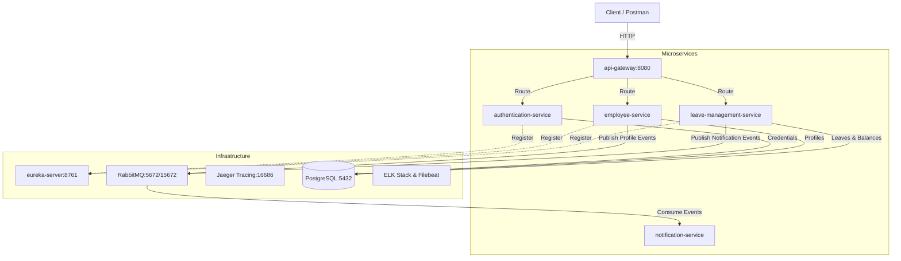

# NAGP Leave Management Portal

A containerized, event-driven Spring Boot microservices application for managing employee profiles, leave requests, and leave balances. The stack integrates centralized logging (ELK Stack), distributed tracing (Jaeger via OpenTelemetry), asynchronous event-driven messaging (RabbitMQ), and persistent storage (PostgreSQL).

---

## 1. System Architecture

The portal consists of the following microservices and infrastructure components:



### Microservice Summary:
* **`eureka-server`** (Port `8761`): Service registry for dynamic discovery and load balancing.
* **`api-gateway`** (Port `8080`): Gateway routing requests to downstream services and distributing load between scaled replicas.
* **`authentication-service`**: Handles JWT issuance, validation, and role-based authorization.
* **`employee-service`**: Manages employee profiles and hierarchy (manager-employee relationships).
* **`leave-management-service`**: Manages leave request processing, balance checks, and concurrency control.
* **`notification-service`**: Asynchronously listens for RabbitMQ events to process alerts.

---

## 2. Setup and Prerequisites

Ensure the following tools are installed on your host system:
* **Java Development Kit (JDK) 17**
* **Apache Maven 3.8+**
* **Docker Engine** & **Docker Compose**

---

## 3. How to Run with Docker Compose

Follow these steps to compile and spin up the complete infrastructure stack:

### Step 1: Package the Microservices
Build the Java packages using Maven:
```bash
mvn clean package -DskipTests
```

### Step 2: Boot the Infrastructure and Containers
Launch all services in detached mode:
```bash
docker-compose up --build -d
```

### Step 3: Verify Container Health
Check the container status to verify they are healthy and running:
```bash
docker-compose ps
```

### Step 4: Access System Dashboards
* **Eureka Service Registry**: [http://localhost:8761](http://localhost:8761)
* **Kibana (Centralized Logs)**: [http://localhost:5601](http://localhost:5601)
* **Jaeger (Distributed Tracing)**: [http://localhost:16686](http://localhost:16686)
* **RabbitMQ Management**: [http://localhost:15672](http://localhost:15672) (User: `guest`, Pass: `guest`)

To shut down the environment:
```bash
docker-compose down
```
To shut down and wipe persistent volumes (re-seeding databases on next boot):
```bash
docker-compose down -v
```

---

## 4. Environment Variables Needed

The services are parameterized to support easy overrides. When deployed in Docker, these variables are injected dynamically.

| Variable Name | Description | Default Value (Local Fallback) |
| :--- | :--- | :--- |
| `SPRING_PROFILES_ACTIVE` | Active Spring application profiles | `default` (H2 fallback deactivated, PostgreSQL driver used) |
| `SPRING_DATASOURCE_URL` | Database connection URL | `jdbc:postgresql://localhost:5432/<db_name>` |
| `SPRING_DATASOURCE_USERNAME` | Database username | `admin` |
| `SPRING_DATASOURCE_PASSWORD` | Database password | `admin` |
| `SPRING_JPA_DATABASE_PLATFORM`| Dialect platform class | `org.hibernate.dialect.PostgreSQLDialect` |
| `SPRING_RABBITMQ_HOST` | Host address of RabbitMQ broker | `localhost` |
| `EUREKA_CLIENT_SERVICE_URL_DEFAULTZONE` | Endpoint for service registration | `http://localhost:8761/eureka/` |
| `MANAGEMENT_OTLP_TRACING_ENDPOINT` | OpenTelemetry endpoint for tracing | `http://localhost:4318/v1/traces` |

---

## 5. API Testing Instructions

An exportable Postman collection is included directly in the root directory:
* [Leave_Portal.postman_collection.json](Leave_Portal.postman_collection.json)

For detailed documentation of requests, refer to [POSTMAN DOCUMENTATION ](POSTMAN_DOCUMENTATION.md).

### Seeded Mock Users:
The databases automatically seed the following accounts for testing on initial startup:
* `employee1` (Password: `password`, Role: `EMPLOYEE`)
* `employee2` (Password: `password`, Role: `EMPLOYEE`)
* `manager1` (Password: `password`, Role: `MANAGER`)

### Standard Testing Flow:

#### 1. Authenticate (Get JWT Token)
Send a login request to the gateway to receive your authorization token:
* **Request**: `POST http://localhost:8080/auth/login`
* **Body**:
  ```json
  {
    "username": "employee1",
    "password": "password"
  }
  ```
* **Response**: Save the returned JWT token value.

#### 2. Configure Authorization in Postman
For all subsequent requests, pass the JWT token inside the request header:
* **Header**: `Authorization: Bearer <your_jwt_token>`

#### 3. View Leave Balances
* **Request**: `GET http://localhost:8080/leaves/balances`
* **Headers**: `Authorization: Bearer <token>`
* **Description**: Returns Casual, Sick, and Privilege leave allocations.

#### 4. Apply for Leave
* **Request**: `POST http://localhost:8080/leaves/apply`
* **Headers**: `Authorization: Bearer <token>`
* **Body**:
  ```json
  {
    "leaveType": "CASUAL",
    "startDate": "2026-06-15",
    "endDate": "2026-06-19",
    "reason": "Family vacation",
    "managerId": 3
  }
  ```
* **Description**: Submits a pending request. If valid, the leave days are immediately deducted from the balance.

#### 5. Approve or Reject Leave (Requires Manager Authorization)
Login as `manager1` to get a Manager JWT token, then approve or reject the request:
* **Request**: `POST http://localhost:8080/leaves/{leaveRequestId}/approve` (or `/reject`)
* **Headers**: `Authorization: Bearer <manager_token>`
* **Description**: Sets status to `APPROVED` or `REJECTED`. Rejections will immediately restore the deducted days to the employee's balance.
