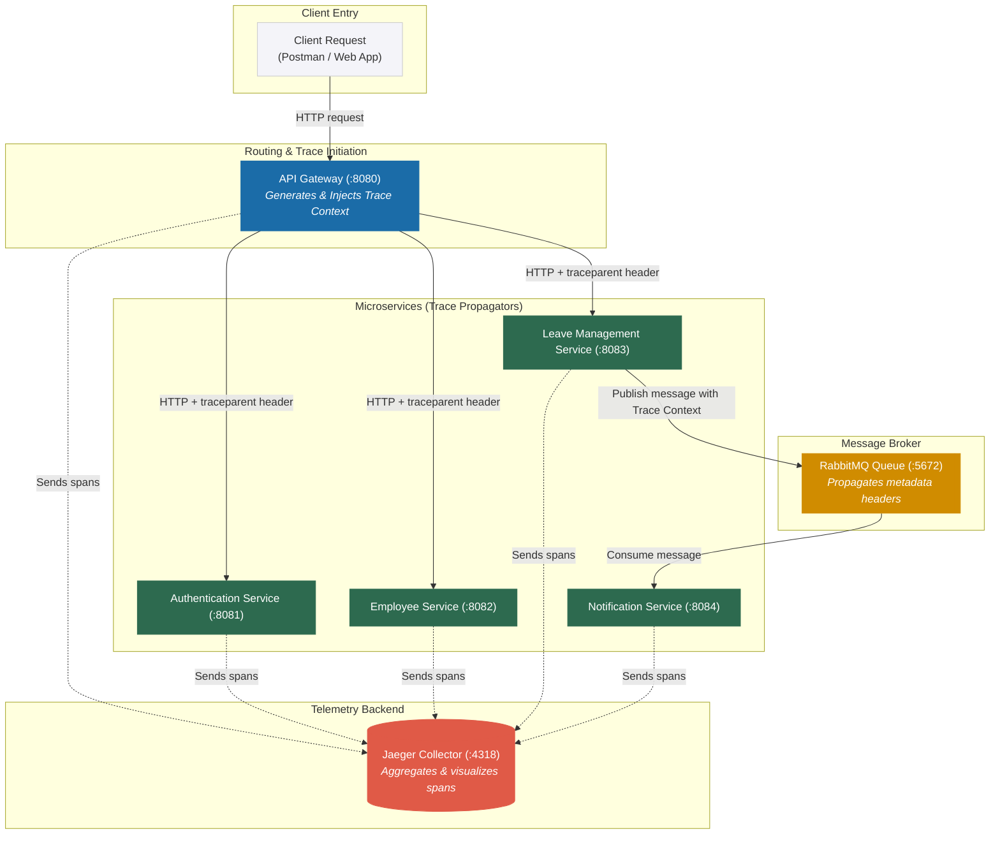

# Distributed Tracing 
This document explains how **Distributed Tracing** is configured and implemented across the microservices in this project using Micrometer Tracing, OpenTelemetry (OTel), and Jaeger.

---

## Why Distributed Tracing?

In a microservice architecture, a single client action (e.g., applying for a leave) triggers a chain of events across multiple service boundaries:
1. The **API Gateway** routes the request.
2. The **Authentication Service** validates or handles credentials.
3. The **Leave Management Service** calculates leave days and records the request.
4. The **Notification Service** consumes an asynchronous RabbitMQ message to notify the employee/manager.

Distributed tracing allows us to visualize this entire execution path, track latencies, and pinpoint errors across service boundaries using a unique trace ID that is propagated through HTTP headers and message metadata.

---

## How the Request Flow & Tracing Works



Every hop in the request chain shares the same **Trace ID**, but has a unique **Span ID** representing that specific unit of work.

---

## Tech Stack & Dependencies

The tracing functionality is powered by the following libraries configured in each service's `pom.xml`:

- **Spring Boot Actuator (`spring-boot-starter-actuator`)**: Required for the auto-configuration of tracing, observation registry, and OTLP exporter beans. Without this, Spring Boot 3 will not process the tracing configuration.
- **Micrometer Tracing Bridge OTel (`micrometer-tracing-bridge-otel`)**: Bridges Spring Boot's Micrometer observation APIs with OpenTelemetry.
- **OpenTelemetry Exporter OTLP (`opentelemetry-exporter-otlp`)**: Exports tracing data using the standard OpenTelemetry Protocol (OTLP) over HTTP/gRPC.


---

## Configuration Details

Distributed tracing is configured across all **5 microservices** in their respective `application.yml` configuration files:

1. `api-gateway`
2. `authentication-service`
3. `employee-service`
4. `leave-management-service`
5. `notification-service`

### `application.yml` Settings

#### 1. Distributed Tracing Settings (All 5 Services)
```yaml
management:
  otlp:
    tracing:
      endpoint: http://localhost:4318/v1/traces   # OTLP HTTP receiver endpoint for local dev
  tracing:
    sampling:
      probability: 1.0                            # Traces 100% of requests (Recommended for Dev)
```

#### 2. RabbitMQ Message Tracing Settings (Employee, Leave, and Notification Services)
To propagate tracing headers through RabbitMQ asynchronously, observation must be explicitly enabled for the template and listener:
```yaml
spring:
  rabbitmq:
    listener:
      simple:
        observation-enabled: true
    template:
      observation-enabled: true
```

> [!IMPORTANT]
> Because custom `@Bean` definitions are used for `RabbitTemplate` (in `employee-service`, `leave-management-service`, and `notification-service`) and `SimpleRabbitListenerContainerFactory` (in `notification-service`), the `application.yml` properties are not automatically applied to them. Instead, we programmatically enable observation by calling `.setObservationEnabled(true)` on these customized `RabbitTemplate` and `SimpleRabbitListenerContainerFactory` beans in their respective Java configurations.


### Environment Overrides (Docker vs. Local)

To support seamless transitions between local IDE runs and containerized runs, the endpoint configuration adapts dynamically:

| Environment | OTLP Endpoint | Origin |
| :--- | :--- | :--- |
| **Local Development** (IDE / Maven) | `http://localhost:4318/v1/traces` | `application.yml` |
| **Docker Compose** (`docker-compose.yml`) | `http://jaeger:4318/v1/traces` | Injected environment variable: `MANAGEMENT_OTLP_TRACING_ENDPOINT` |

> **Note**: Spring Boot automatically binds environment variables (like `MANAGEMENT_OTLP_TRACING_ENDPOINT`) to overwrite properties defined in `application.yml`.

---


## How to Verify & View Traces

### Step 1: Start Jaeger
Jaeger is included in the project's `docker-compose.yml` file. Start it along with the microservices:
```bash
docker-compose up -d jaeger
```
Jaeger exposes the following ports:
- `16686` (Jaeger UI Web Portal)
- `4318` (OTLP HTTP Receiver endpoint)

### Step 2: Trigger API Requests
Using Postman or any client, make requests to the API Gateway. For example, apply for a leave:
```http
POST http://localhost:8080/leaves/apply
Content-Type: application/json
Authorization: Bearer <your_jwt_token>

{
  "employeeId": 1,
  "leaveType": "CASUAL",
  "fromDate": "2026-06-01",
  "toDate": "2026-06-05",
  "reason": "Family trip"
}
```

### Step 3: Open the Jaeger Dashboard
1. Open your browser and navigate to `http://localhost:16686`.
2. Under the **Service** dropdown, select `api-gateway`.
3. Click **Find Traces**.
4. Click on any trace to inspect the breakdown.

### Example of a Trace Timeline
A successful leave application request will show spans across multiple services:

```text
api-gateway ───────────────────────────────────────────────────────────── [12ms]
  └── leave-management-service ────────────────────────────────────────── [9ms]
        ├── database (insert/select query) ──────────────── [2ms]
        └── rabbitmq (publish message) ──────────────────── [1ms]
              └── notification-service (consume message) ── [2ms]
```

Each span shows start time, duration, and detailed tags (e.g., HTTP method, URI path, DB query, RabbitMQ queue name).
