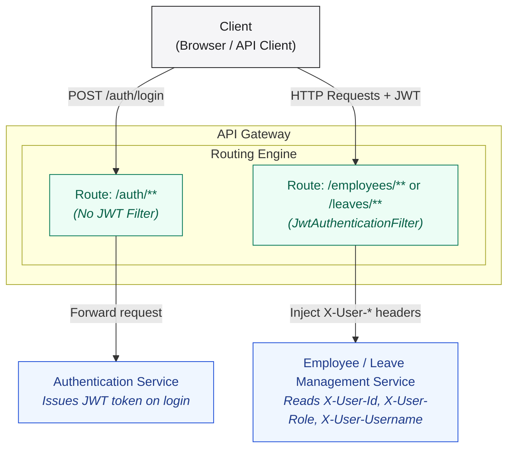
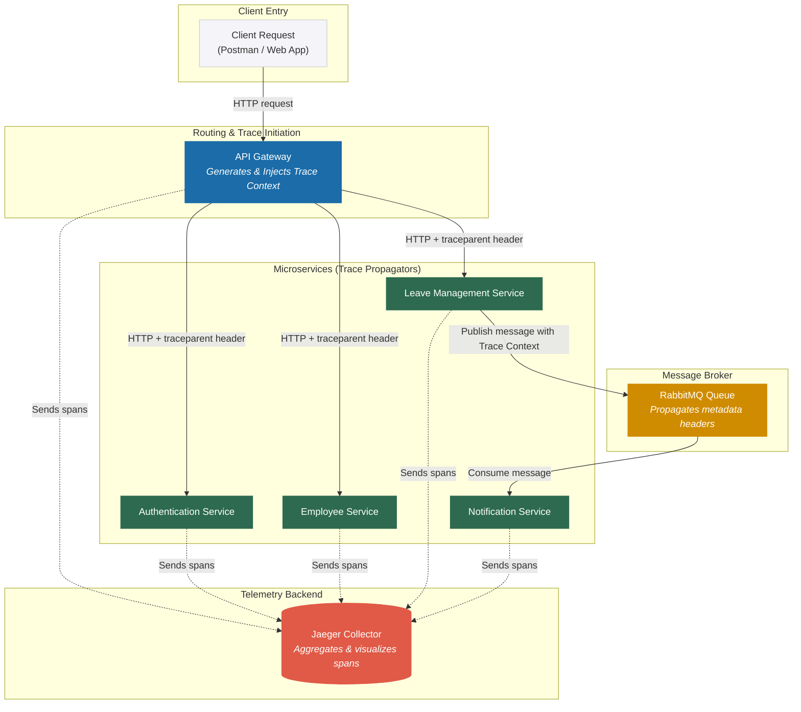

# Cross-Cutting Concerns

This document details the cross-cutting concerns implemented across the microservices in this project. 

---

## Table of Contents

- [1. Logging](#1-logging)
- [2. Circuit Breaker Pattern](#2-circuit-breaker-pattern)
- [3. Authentication & Authorization](#3-authentication--authorization)
- [4. Global Exception Handling](#4-global-exception-handling)
- [5. Distributed Tracing](#5-distributed-tracing)

---

## 1. Logging

This section explains how structured logging is implemented across all microservices in this project.

---

### Overview

All services previously used simple standard console outputs for diagnostic tracing, which lacked severity levels, timestamps, and cannot be parsed by log collectors. These have been migrated to the standard **SLF4J + Logback** structured logging framework.

---

### How It Works

Every class that requires logging is decorated with metadata annotations that inject a standard slf4j `Logger` instance at compile time. 

Diagnostic logging practices strictly follow **parameterized logging** instead of runtime string concatenation to prevent garbage collection overhead when debugging messages are turned off.

---

### Log Levels Used

| Level | When It Is Used |
|-------|-----------------|
| `INFO` | Normal business events — request received, record created, event published/consumed |
| `WARN` | Expected but notable failures — validation errors, access denied, circuit breaker open |
| `DEBUG` | Verbose detail useful during development — JWT claims, record skipped |
| `ERROR` | Unexpected exceptions — event publish failures |

---

### Sample Log Output

Below is what typical log outputs look like after this implementation, showing request validation, gateway tracing, and async event dispatching:

```text
2026-05-28 10:22:01.412  DEBUG [api-gateway] --- Incoming request: POST /leaves/apply
2026-05-28 10:22:01.415  DEBUG [api-gateway] --- JWT validated — userId=1, role=EMPLOYEE, username=employee1
2026-05-28 10:22:01.431   INFO [leave-management-service] --- Leave application received — employeeId=1, type=CASUAL, days=3
2026-05-28 10:22:01.445   INFO [leave-management-service] --- Leave applied successfully — leaveId=12, employeeId=1
2026-05-28 10:22:01.460   INFO [notification-service] --- SIMULATED NOTIFICATION — type=APPLICATION, employeeId=1, leaveId=12, status=PENDING, dates=2026-06-02 to 2026-06-04
```

And when a business rules validation fails:

```text
2026-05-28 10:23:15.302   INFO [leave-management-service] --- Leave application received — employeeId=2, type=SICK, days=12
2026-05-28 10:23:15.318   WARN [leave-management-service] --- Leave rejected — insufficient balance — employeeId=2, remaining=8, requested=12
```

---

### How to Access and Configure Logs

#### 1. Direct Console Output (Running via Maven/Java)
When running services locally using the Maven wrapper or as standalone JAR files, logs write directly to standard terminal outputs.

#### 2. Running via Docker Compose
When running the containerized stack:
* **Tail logs for all containers:**
  ```bash
  docker-compose logs -f
  ```
* **Tail logs for a single container:**
  ```bash
  docker-compose logs -f leave-management-service
  ```
* **Filter logs in real time:**
  ```bash
  docker-compose logs -f employee-service | grep "com.niloy"
  ```

---

## 2. Circuit Breaker Pattern

This section explains how the **Circuit Breaker** pattern is implemented in this project.

---

### Where It Is Implemented

The Circuit Breaker is placed at the **API Gateway** (`api-gateway`, port `8080`) — the single entry point for all client traffic. This means every request from a client passes through the breaker before reaching any downstream microservice. The gateway implements this pattern using the Resilience4j library via Spring Cloud Circuit Breaker.

---

### How the Request Flow Works

```
Client (Postman / App)
        │
        ▼
  API Gateway :8080
        │
        ├─ [JwtAuthenticationFilter]  ← validates JWT token (for /employees & /leaves)
        │
        ├─ [CircuitBreakerFilter]     ← monitors failures per service
        │
        │   ┌──────────────┬──────────────────────────────────┐
        │   │  CLOSED      │  Normal – request forwarded      │
        │   │  (healthy)   │  to downstream service           │
        │   └──────────────┴──────────────────────────────────┘
        │
        │   ┌──────────────┬──────────────────────────────────┐
        │   │  OPEN        │  Circuit tripped – request is    │
        │   │  (unhealthy) │  short-circuited, gateway calls  │
        │   │              │  /fallback/<service> immediately │
        │   └──────────────┴──────────────────────────────────┘
        │
        ▼
  Downstream Microservice  OR  FallbackController (503 JSON)
```

---

### Route → Circuit Breaker → Fallback Mapping

Each gateway route has its own dedicated Circuit Breaker instance and a unique fallback URI:

| Client Route | Downstream Service | CB Instance | Fallback Endpoint |
|--------------|--------------------|-------------|-------------------|
| `/auth/**` | Authentication Service | `authServiceCB` | `/fallback/auth` |
| `/employees/**` | Employee Service  | `employeeServiceCB` | `/fallback/employee` |
| `/leaves/**` | Leave Management Service | `leaveServiceCB` | `/fallback/leave` |

If any downstream route experiences failures above the configured threshold, the API Gateway interceptor will transition to an `OPEN` state and direct requests to the respective fallback endpoint.

---

### Resilience4j Configuration

Each Circuit Breaker instance has its own threshold settings defined inside the application configuration:

#### Configuration Settings Summary

| Breaker Instance | Sliding Window Size | Min Calls | Failure Threshold | Wait (Open) | Permitted Calls in Half-Open |
|---|---|---|---|---|---|
| `authServiceCB` | 10 calls | 5 calls | 50% failure rate | 10 seconds | 3 calls |
| `employeeServiceCB` | 20 calls | 10 calls | 50% failure rate | 5 seconds | 3 calls |
| `leaveServiceCB` | 20 calls | 10 calls | 50% failure rate | 5 seconds | 3 calls |

---

### Fallback Mechanism

When a circuit transitions to the `OPEN` state, Spring Cloud Gateway internally forwards the request to a dedicated fallback controller endpoint instead of attempting to contact the failing downstream service.

There is one fallback handler method per service (`/fallback/auth`, `/fallback/employee`, `/fallback/leave`). Each returns a standard `503 Service Unavailable` response with a structured JSON error body.

**Sample response when Leave Management Service is down:**
```json
{
  "timestamp": "2026-05-26T13:25:00Z",
  "status": 503,
  "error": "Service Unavailable",
  "code": "LEAVE_SERVICE_UNAVAILABLE",
  "message": "The Leave Management Service is currently unavailable. Your request has not been processed. Please try again later.",
  "path": "/leaves"
}
```

---

### Monitoring Circuit Breaker Health

The gateway exposes Actuator endpoints to inspect the real-time state of each Circuit Breaker:
- `/actuator/health`: Returns the health status of all three CB instances showing whether they are `CLOSED`, `OPEN`, or `HALF_OPEN`.
- `/actuator/circuitbreakers`: Returns failure rates, call counts, and current states for each CB instance.
- `/actuator/circuitbreakerevents`: Lists all state transitions and events logged by Resilience4j.

---

## 3. Authentication & Authorization

This section explains how authentication (verifying *who* a user is) and authorization (verifying *what* a user can do) are implemented as cross-cutting concerns across all microservices in this project.

---

### Overview

Security is enforced at **two layers**:

| Layer | Service | Responsibility |
|-------|---------|----------------|
| **Authentication** | `authentication-service` | Validate credentials, issue signed JWT tokens |
| **Authorization (Gateway)** | `api-gateway` | Intercept every inbound request, validate JWT, propagate identity headers |
| **Authorization (Business)** | `employee-service`, `leave-management-service` | Read propagated headers and enforce role-based rules |

The design ensures that **no downstream microservice trusts the raw client request**. The gateway acts as a single enforcement point: if a token is absent or invalid, the request is rejected before it ever reaches a business service.

---

### Architecture



---

### Part 1 – Authentication (`authentication-service`)

#### Responsibility

The Authentication Service is the only component that has access to the user credentials database. Its sole job is to validate a username/password pair and return a signed JWT if the credentials are correct.

#### User Model

The user profile mapping is persisted in the `users` table. Passwords are **never stored in plaintext**. All passwords are hashed with BCrypt before persistence.

#### Login Endpoint

* **Endpoint**: `POST /auth/login`
* **Flow**:
  1. Look up the user by username from the database.
  2. Use BCrypt password hashing comparison to verify the credentials.
  3. If invalid, reject the login request (returning HTTP 401).
  4. If valid, generate a signed JWT containing claims for user ID, username, and role.

#### JWT Token Design

| JWT Field | Value |
|-----------|-------|
| **Algorithm** | `HS256` (HMAC-SHA256) |
| **Subject (`sub`)** | User ID (as string) |
| **Custom claim: `role`** | `EMPLOYEE` or `MANAGER` |
| **Custom claim: `username`** | Authenticated username |
| **Expiry** | 24 hours |
| **Signing key** | Shared HMAC secret |

#### Security Configuration

The Authentication Service's own HTTP layer is configured to allow public access to the `/auth/login` endpoint so users can request tokens.

---

### Part 2 – Gateway-Level JWT Validation (`api-gateway`)

#### Responsibility

The API Gateway intercepts **every inbound HTTP request**. For all routes except public endpoints (like `/auth/**`), it validates the JWT from the `Authorization` header before forwarding to the downstream service.

#### JWT Validation Filter Flow

```
Request arrives at gateway
        │
        ├─ Path contains "/auth/login"? ──YES──► Forward without validation
        │
        ├─ Authorization header missing? ──YES──► 401 Unauthorized
        │
        ├─ Header not "Bearer <token>"? ──YES──► 401 Unauthorized
        │
        ├─ Token signature invalid / expired? ──YES──► 401 Unauthorized
        │
        └─ Token valid ──────────────────────────► Extract claims
                                                   Mutate request headers
                                                   Forward to downstream service
```

**Claims extraction and header injection:**
The Gateway extracts the claims (`userId`, `role`, and `username`) from the token and injects them as downstream HTTP headers:
- `X-User-Id`
- `X-User-Role`
- `X-User-Username`

After the gateway injects these headers, **no downstream service needs to parse or validate the JWT**. They simply read these trusted headers.

#### Gateway JWT Utility

The gateway has a utility component that validates the HMAC signature (`HS256`) and checks if the token has expired. The same HMAC secret (`jwt.secret`) is shared between the authentication service and the gateway.

---

### Part 3 – Role-Based Authorization (Downstream Services)

Once the gateway has validated the JWT and injected headers, individual business services perform **role-based access control (RBAC)** by reading those headers directly.


#### Authorization Matrix

| Operation | `EMPLOYEE` | `MANAGER` |
|-----------|:----------:|:---------:|
| `POST /auth/login` | ✅ | ✅ |
| `GET /employees/{own-id}` | ✅ | ✅ |
| `GET /employees/{other-id}` | ❌ | ✅ |
| `POST /employees` | ❌ | ✅ |
| `POST /leaves/apply` | ✅ | ❌ |
| `GET /leaves/{own-id}` | ✅ | ✅ |
| `PATCH /leaves/{id}/approve` | ❌ | ✅ |
| `PATCH /leaves/{id}/reject` | ❌ | ✅ |
| `DELETE /leaves/{id}/cancel` | ✅ | ❌ |

---

### Configuration

Both the authentication service and API gateway are configured to share the exact same JWT signature key. In a production environment, this secret is injected via environment variables and never checked into source control.

---

### Request Lifecycle

The following shows the complete flow for an authenticated API call:

```
1. Client → POST /auth/login { username, password }
   └── Gateway: /auth/** route has no JWT filter → forwarded directly

2. authentication-service:
   ├── Looks up user by username
   ├── Compares password hash → true
   └── Returns JWT token and user metadata

3. Client → POST /leaves/apply
   Headers: { Authorization: "Bearer <token>" }
   └── Gateway: /leaves/** → JWT Authentication Filter runs

4. JWT Authentication Filter:
   ├── Extracts token from Authorization header
   ├── Validates signature and expiry
   ├── Extracts claims (userId, role, username)
   └── Mutates request headers:
       ├── X-User-Id
       ├── X-User-Role
       └── X-User-Username

5. leave-management-service:
   ├── Reads X-User-Role → permitted to apply
   ├── Reads X-User-Id  → sets employeeId
   └── Processes leave application
```

---

### Error Responses

| Scenario | HTTP Status | Message |
|----------|:-----------:|---------|
| Missing `Authorization` header | `401` | `No Authorization Header` |
| Header present but not `Bearer ...` format | `401` | `Invalid Authorization Header Format` |
| Token signature invalid or tampered | `401` | `Invalid Token` |
| Token expired | `401` | `Invalid Token` |
| Wrong username or password on login | `401` | `Invalid username or password` |
| `EMPLOYEE` attempts manager-only action | `403` | `Only managers can...` |
| `EMPLOYEE` attempts to access another employee's data | `403` | `Access denied` |

---

### Key Design Decisions

#### 1. Stateless JWT — No Server-Side Session

The system uses **stateless JWT** tokens. No session state is stored on the server. Each request is self-contained — the token carries all the identity and role information the services need.

#### 2. Single Enforcement Point at the Gateway

JWT validation happens **once** at the gateway, not in every downstream service. Downstream services trust the `X-User-*` headers because they can only be set by the gateway.

#### 3. Shared Secret (HS256) vs. Public Key (RS256)

The system uses a shared HMAC secret for fast signature verification. For production systems, an asymmetric key pair (RS256) is standard to prevent downstream nodes from signing tokens.

#### 4. No JWT Parsing in Business Services

Business services never parse the JWT. They only read the injected headers. This keeps the business logic simple and removes cryptography dependencies from the microservices.

#### 5. BCrypt for Password Hashing

Passwords are encrypted using BCrypt, which automatically incorporates a random salt, protecting against rainbow table attacks.

---

## 4. Global Exception Handling

Every microservice in this project utilizes a centralized exception handling mechanism to ensure a consistent error format for API consumers.

---

### Standard Error Response Shape

All errors return a unified JSON payload mapping to Spring MVC `@RestControllerAdvice` (for MVC services) or a reactive `WebExceptionHandler` (for `api-gateway`):

```json
{
  "timestamp": "2026-05-26T14:00:00Z",
  "status": 404,
  "error": "Not Found",
  "message": "Leave request not found with ID: 99",
  "path": "/leaves/99/approve"
}
```

---

### Custom Exception Mapping Matrix

Controllers throw custom domain exceptions which are automatically caught and translated into the standard response shape:

| Exception Type | Target Service | HTTP Status | Standard Message Pattern |
|:---|:---|:---:|:---|
| `EmployeeNotFoundException` | `employee-service` | 404 Not Found | *Employee not found with ID: id* |
| `EmployeeAlreadyExistsException` | `employee-service` | 400 Bad Request | *Employee already exists with ID: id* |
| `LeaveRequestNotFoundException` | `leave-management-service` | 404 Not Found | *Leave request not found with ID: id* |
| `InsufficientLeaveBalanceException` | `leave-management-service` | 400 Bad Request | *Insufficient leave balance. Remaining: X, Requested: Y* |
| `InvalidLeaveRequestException` | `leave-management-service` | 400 Bad Request | Custom business validation description |
| `LeaveConflictException` | `leave-management-service` | 409 Conflict | *Overlapping leave request detected for these dates.* |
| `AccessDeniedException` | MVC Services | 403 Forbidden | Custom authorization description |
| `InvalidCredentialsException` | `authentication-service` | 401 Unauthorized | *Invalid username or password* |

---

## 5. Distributed Tracing

This section explains how **Distributed Tracing** is configured and implemented across the microservices in this project using Micrometer Tracing, OpenTelemetry (OTel), and Jaeger.

---

### How the Request Flow & Tracing Works



Every hop in the request chain shares the same **Trace ID**, but has a unique **Span ID** representing that specific unit of work.

---

### Configuration Details

Distributed tracing is enabled across all 5 microservices. The telemetry collector endpoint defaults to `http://localhost:4318/v1/traces` for local runs, and propagates tracing context through RabbitMQ queues for async message flows.

#### Environment Overrides (Docker vs. Local)

To support seamless transitions between local IDE runs and containerized environments, the endpoint configuration adapts dynamically:

| Environment | OTLP Endpoint | Origin |
| :--- | :--- | :--- |
| **Local Development** (IDE / Maven) | `http://localhost:4318/v1/traces` | Local application configuration properties |
| **Docker Compose** (`docker-compose.yml`) | `http://jaeger:4318/v1/traces` | Injected environment variable: `MANAGEMENT_OTLP_TRACING_ENDPOINT` |

---

### How to Verify & View Traces

#### Step 1: Start Jaeger
Jaeger is included in the project's Docker environment. Ensure the container is active.
Jaeger exposes:
- **16686**: Jaeger UI Web Portal
- **4318**: OTLP HTTP Receiver endpoint

#### Step 2: Trigger API Requests
Using Postman or any API client, make request calls to the API Gateway (such as applying for a leave).

#### Step 3: Open the Jaeger Dashboard
1. Open your browser and navigate to `http://localhost:16686`.
2. Under the **Service** dropdown, select `api-gateway`.
3. Click **Find Traces**.
4. Click on any trace to inspect the breakdown.

#### Example of a Trace Timeline
A successful leave application request will show spans across multiple services:

```text
api-gateway ───────────────────────────────────────────────────────────── [12ms]
  └── leave-management-service ────────────────────────────────────────── [9ms]
        ├── database (insert/select query) ──────────────── [2ms]
        └── rabbitmq (publish message) ──────────────────── [1ms]
              └── notification-service (consume message) ── [2ms]
```

Each span shows start time, duration, and detailed tags (such as HTTP method, URI path, database queries, and RabbitMQ exchange/routing keys).
