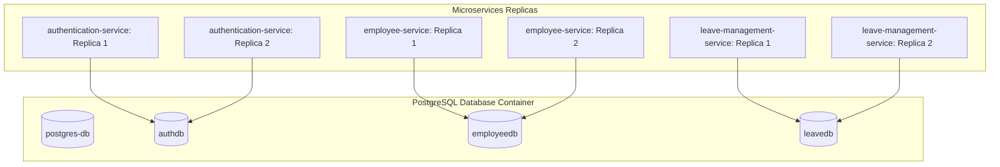

# Database Persistence and Concurrency Consistency

When scaling microservices to multiple instances (replicas), using local in-memory databases creates isolated state silos. Centralized database storage and concurrency controls are required to prevent data inconsistency.

---

## 1. Architecture Overview

A single centralized database engine is used with separate logical databases to enforce the **Database-per-Service** pattern while preserving persistent storage across scaled instances.



### Key Components
1. **Centralized Engine**: Runs PostgreSQL as a containerized service.
2. **Logical Isolation**:
   - `authdb`: Credentials and roles.
   - `employeedb`: Employee profiles.
   - `leavedb`: Leave requests and balances.
3. **Automatic Creation**: Script runs on first boot to create the logical databases.

---

## 2. Concurrency Control (Optimistic Locking)

To prevent data corruption from concurrent updates (e.g., duplicate leave balance deductions), **Optimistic Locking** is used:

1. **Version Field**: Each entity contains a version column mapped to an integer in the database.
2. **Read Phase**: Replica A loads a record with a version number (e.g., `version = 5`).
3. **Write Phase**: Replica A updates the record using a conditional query:
   ```sql
   UPDATE leave_balances SET used = 10, version = 6 WHERE id = 1 AND version = 5;
   ```
4. **Collision Detection**: If Replica B has concurrently updated the record first, the version is already `6`. Replica A's query will match 0 rows, prompting the application to reject the transaction and prevent overwrites.

---

## 3. Conflict Resolution

When a concurrent write conflict occurs, the API returns a structured HTTP `409 Conflict` response:

```json
{
  "timestamp": "2026-05-29T11:20:00Z",
  "status": 409,
  "error": "Conflict",
  "message": "The resource was updated concurrently by another request. Please reload and try again.",
  "path": "/leaves/1/approve"
}
```

---

## 4. Lifecycle & Volume Persistence

| Scenario | Database Container Lifecycle | Data Persistence |
| :--- | :--- | :--- |
| **Microservice stopped / restarted** | Database container remains active | Data is **preserved** |
| **`docker-compose down`** | Database container stops | Data is **preserved** (saved in Docker volume `pgdata`) |
| **`docker-compose down -v`** | Database container and volumes are deleted | Data is **destroyed** (wipes the `pgdata` volume) |
| **Service Bootstrap Seeding** | Service checks database count | Data is **preserved** (seeding checks are idempotent) |
