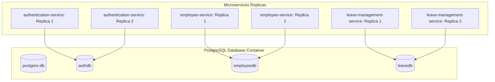

# Database Persistence and Concurrency Consistency Documentation

When scaling microservices to multiple instances (replicas), using local in-memory databases (such as H2) creates isolated state silos. A write request sent to Instance A is invisible to Instance B, leading to inconsistent query results and data loss upon container restarts.

This document describes the architecture and mechanisms implemented to provide persistent, centralized data storage and write consistency across all scaled microservice replicas.

---

## 1. Architecture Overview

To ensure data persistence and logical isolation while respecting the **Database-per-Service** pattern, a single shared database engine is used with separate logical databases.



### Key Components:
1. **Shared Database Container (`postgres-db`)**: Runs PostgreSQL 15 as a container service in `docker-compose.yml`.
2. **Logical Database Isolation**:
   - `authdb`: Holds credential and role mapping records.
   - `employeedb`: Holds employee profiles.
   - `leavedb`: Holds leave requests and leave balances.
3. **Database Initialization**: An initialization script (`postgres-init/init.sql`) runs automatically when the container boots for the first time to create the three databases.

---

## 2. Configuration & Dependencies

### Maven Configuration
The  `postgresql` driver was configured in each service's `pom.xml`:
```xml
<dependency>
    <groupId>org.postgresql</groupId>
    <artifactId>postgresql</artifactId>
    <scope>runtime</scope>
</dependency>
```

### Spring Boot Properties
Each microservice is configured with parameterized environment variables that fallback to local PostgreSQL parameters for seamless execution outside of Docker:
```yaml
spring:
  datasource:
    url: ${SPRING_DATASOURCE_URL:jdbc:postgresql://localhost:5432/leavedb}
    driverClassName: org.postgresql.Driver
    username: ${SPRING_DATASOURCE_USERNAME:admin}
    password: ${SPRING_DATASOURCE_PASSWORD:admin}
  jpa:
    database-platform: org.hibernate.dialect.PostgreSQLDialect
    hibernate:
      ddl-auto: update
```

---

## 3. Concurrency Control (Optimistic Locking)

When multiple instances of the same service read and update the same entity concurrently, race conditions can occur (e.g., two managers approving different leave requests at the exact same millisecond, leading to double-deductions of remaining leave balances).

To guarantee write consistency, **Optimistic Locking** has been implemented.

### How it Works:
1. Every entity is added a `@Version` field (tracked in Java and mapped to an integer column in the database):
   ```java
   import jakarta.persistence.Version;

   @Entity
   public class LeaveBalance {
       // ...
       @Version
       private Integer version;
   }
   ```
2. When Instance A loads a record, it retrieves the current version (e.g., `version = 5`).
3. If Instance A updates the record, Hibernate issues an SQL update:
   ```sql
   UPDATE leave_balances SET used = 10, version = 6 WHERE id = 1 AND version = 5;
   ```
4. If Instance B concurrently updated the record first, the version in the database is already `6`. The `UPDATE` query by Instance A matches 0 rows.
5. Hibernate detects that 0 rows were updated and throws an `ObjectOptimisticLockingFailureException`, preventing the overwrite.

---

## 4. Exception Handling

To prevent concurrent write conflicts from crashing the application and returning a raw `500 Internal Server Error`, a dedicated exception handler is registered in the `GlobalExceptionHandler` of each service:

```java
@ExceptionHandler(org.springframework.orm.ObjectOptimisticLockingFailureException.class)
public ResponseEntity<ErrorResponse> handleOptimisticLocking(
        org.springframework.orm.ObjectOptimisticLockingFailureException ex, HttpServletRequest req) {
    log.warn("Concurrent modification failed at [{}]: {}", req.getRequestURI(), ex.getMessage());
    return ResponseEntity
            .status(HttpStatus.CONFLICT)
            .body(ErrorResponse.of(409, "Conflict", 
                    "The resource was updated concurrently by another request. Please reload and try again.", 
                    req.getRequestURI()));
}
```

### Error Response payload:
```json
{
  "timestamp": "2026-05-29T11:20:00Z",
  "status": 409,
  "error": "Conflict",
  "message": "The resource was updated concurrently by another request. Please reload and try again.",
  "path": "/leaves/1/approve"
}
```

---

## 5. Local and Container Lifecycle Summary

| Scenario | Database Lifecycle | Data Persistence |
| :--- | :--- | :--- |
| **Microservice stopped / restarted** | Database container remains up | Data is **preserved** |
| **`docker-compose down`** | Database container stops | Data is **preserved** (saved in Docker volume `pgdata`) |
| **`docker-compose down -v`** | Database container and volumes are deleted | Data is **destroyed** (wipes the `pgdata` volume) |
| **Hibernate starts** | Hibernate checks schema structures | Data is **preserved** (`ddl-auto: update` does not drop data) |
| **Service Bootstrap Seeding** | Service checks database count | Data is **preserved** (seed checks are idempotent) |
