```mermaid
flowchart LR
    subgraph Services ["Microservices (all 6)"]
        GW["api-gateway\n:8080"]
        AS["authentication-service\n:8081"]
        ES["employee-service\n:8082"]
        LS["leave-management-service\n:8083"]
        NS["notification-service\n:8084"]
        EU["eureka-server\n:8761"]
    end

    subgraph ELK ["ELK Stack"]
        FB["Filebeat\n(log shipper)"]
        LST["Logstash\n:5044 / :9600"]
        ESE["Elasticsearch\n:9200"]
        KB["Kibana\n:5601"]
    end

    Services -->|"stdout JSON\n(docker profile)"| FB
    FB -->|"Beats protocol\n:5044"| LST
    LST -->|"Indexed events\n:9200"| ESE
    ESE --> KB

    style ELK fill:#f0f4ff,stroke:#4a6fa5
    style Services fill:#f9fff0,stroke:#5a8a5a
```

# Centralized Logging – ELK Stack Implementation

This document explains how **centralized log aggregation** is configured and implemented across all microservices in the Employee Leave Portal using the **ELK Stack** — Elasticsearch, Logstash, Kibana — with Filebeat as the log shipper.

---

## Why Centralized Logging?

Before this implementation, each microservice printed logs independently to its own console/container stdout. This approach had critical limitations:

| Problem | Impact |
|---|---|
| Logs scattered across 6 containers | No way to correlate an error across services |
| No searchability | Debugging required `docker logs` on each container individually |
| No log retention | Container restart = all logs lost |
| No filtering or alerting | Impossible to watch for `ERROR` across all services in real time |

The ELK Stack solves all of this by providing a single, searchable, indexed, and visualizable log store for all services.

---

## Architecture

```
┌─────────────────────────────────────────────────────────────────────┐
│  Each Microservice (6 services)                                      │
│                                                                      │
│  [Logback + logstash-logback-encoder]                                │
│       │  Emits structured JSON to stdout                             │
│       ▼                                                              │
│  [Docker container stdout/stderr]                                    │
└───────────────┬──────────────────────────────────────────────────────┘
                │  Docker log driver / log files
                ▼
        ┌───────────────┐
        │   Filebeat    │  ← Collects container logs, adds metadata
        │  (log shipper)│     (service name, container id, etc.)
        └───────┬───────┘
                │  Ships to Logstash :5044
                ▼
        ┌───────────────┐
        │   Logstash    │  ← Parses / enriches / filters log events
        └───────┬───────┘
                │  Indexes to Elasticsearch :9200
                ▼
        ┌───────────────┐
        │ Elasticsearch │  ← Stores and indexes all logs
        └───────┬───────┘
                │
                ▼
        ┌───────────────┐
        │    Kibana     │  ← Search, visualize, alert on logs
        │   :5601       │     (Discover, Dashboards, Lens)
        └───────────────┘
```



---

## Services In Scope

| Service | Port | Emits JSON Logs |
|---|---|---|
| `api-gateway` | 8080 | ✅ Yes |
| `authentication-service` | 8081 | ✅ Yes |
| `employee-service` | 8082 | ✅ Yes |
| `leave-management-service` | 8083 | ✅ Yes |
| `notification-service` | 8084 | ✅ Yes |
| `eureka-server` | 8761 | ✅ Yes |

---

## Tech Stack & Dependencies

| Component | Technology | Version |
|---|---|---|
| JSON log encoder | `net.logstash.logback:logstash-logback-encoder` | 7.4 |
| Log collector/shipper | Filebeat | 8.13.0 |
| Log pipeline/enricher | Logstash | 8.13.0 |
| Search & store | Elasticsearch | 8.13.0 |
| Visualization | Kibana | 8.13.0 |

> [!NOTE]
> `logstash-logback-encoder` is declared in the **parent `pom.xml`** under both `<dependencyManagement>` (pinned to 7.4) and the shared `<dependencies>` block. This means **all 6 services inherit it automatically** — no per-service `pom.xml` changes are needed.

---

## Implementation Details

### 1. Parent POM — `pom.xml`

[pom.xml](/pom.xml) was modified to include the encoder in two places:

```xml
<!-- dependencyManagement — pins the version -->
<dependency>
    <groupId>net.logstash.logback</groupId>
    <artifactId>logstash-logback-encoder</artifactId>
    <version>7.4</version>
</dependency>

<!-- shared dependencies — auto-included in every service -->
<dependency>
    <groupId>net.logstash.logback</groupId>
    <artifactId>logstash-logback-encoder</artifactId>
</dependency>
```

---

### 2. Logback Configuration — `logback-spring.xml`

A `logback-spring.xml` file was created in `src/main/resources/` for every service. Each file configures **two appenders**, selected by Spring profile:

| Appender | Name | Profile Active | Output Format |
|---|---|---|---|
| Human-readable | `CONSOLE` | `!docker` (local dev) | `%d{yyyy-MM-dd HH:mm:ss} [%thread] %-5level %logger{36} - %msg%n` |
| Structured JSON | `JSON_STDOUT` | `docker` | `LogstashEncoder` — JSON with `@timestamp`, `level`, `service`, `message`, `logger`, `thread` |

**Full template** (identical across all 6 services):

```xml
<?xml version="1.0" encoding="UTF-8"?>
<configuration>

    <!-- Read the Spring app name for the "service" JSON field -->
    <springProperty scope="context" name="APP_NAME" source="spring.application.name"/>

    <!-- Human-readable console (local dev) -->
    <appender name="CONSOLE" class="ch.qos.logback.core.ConsoleAppender">
        <encoder>
            <pattern>%d{yyyy-MM-dd HH:mm:ss} [%thread] %-5level %logger{36} - %msg%n</pattern>
        </encoder>
    </appender>

    <!-- Structured JSON to stdout (Docker / Filebeat) -->
    <appender name="JSON_STDOUT" class="ch.qos.logback.core.ConsoleAppender">
        <encoder class="net.logstash.logback.encoder.LogstashEncoder">
            <customFields>{"service":"${APP_NAME}"}</customFields>
            <fieldNames>
                <timestamp>@timestamp</timestamp>
                <message>message</message>
                <logger>logger</logger>
                <thread>thread</thread>
                <level>level</level>
            </fieldNames>
        </encoder>
    </appender>

    <!-- Use JSON in Docker profile, console otherwise -->
    <springProfile name="docker">
        <root level="INFO">
            <appender-ref ref="JSON_STDOUT"/>
        </root>
    </springProfile>
    <springProfile name="!docker">
        <root level="INFO">
            <appender-ref ref="CONSOLE"/>
        </root>
    </springProfile>

</configuration>
```

**Files created:**
- [api-gateway/logback-spring.xml](/api-gateway/src/main/resources/logback-spring.xml)
- [authentication-service/logback-spring.xml](/authentication-service/src/main/resources/logback-spring.xml)
- [employee-service/logback-spring.xml](/employee-service/src/main/resources/logback-spring.xml)
- [leave-management-service/logback-spring.xml](/leave-management-service/src/main/resources/logback-spring.xml)
- [notification-service/logback-spring.xml](/notification-service/src/main/resources/logback-spring.xml)
- [eureka-server/logback-spring.xml](/eureka-server/src/main/resources/logback-spring.xml)

> [!IMPORTANT]
> The `service` field in every JSON log event is automatically populated from `spring.application.name` via the `<springProperty>` tag. This is the field you use in Kibana to filter logs by service — e.g. `service: leave-management-service`.

---

### 3. Logging Levels — `application.yml`

All services already had the following `logging:` block configured. The only service that was missing it was `eureka-server`, which was updated:

```yaml
# ── Logging ──────────────────────────────────────────────────────────────────
logging:
  level:
    root: INFO
    com.niloy: DEBUG   # Full DEBUG for all project packages
    org.springframework: WARN
    org.hibernate: WARN
```

**File modified:** [eureka-server/application.yml](/eureka-server/src/main/resources/application.yml) — also had `spring.application.name: eureka-server` added (required by `logback-spring.xml`'s `<springProperty>`).

---

### 4. Logstash Pipeline — `elk/logstash/pipeline/logstash.conf`

[logstash.conf](/elk/logstash/pipeline/logstash.conf) defines the full log processing pipeline:

```text
input {
  beats {
    port => 5044          ← Receives events from Filebeat
  }
}

filter {
  if [message] =~ /^\{/ {
    json {
      source => "message"  ← Parses the JSON string emitted by LogstashEncoder
      target => "log"
    }
    mutate {
      add_field => { "service" => "%{[log][service]}" }  ← Promotes "service" to top level
    }
  }

  date {
    match => ["[log][@timestamp]", "ISO8601"]  ← Syncs Elasticsearch @timestamp
    target => "@timestamp"
  }
}

output {
  elasticsearch {
    hosts => ["http://elasticsearch:9200"]
    index => "leave-portal-logs-%{+YYYY.MM.dd}"  ← Daily index rotation
  }
  stdout { codec => rubydebug }  ← Debug output in Logstash container logs
}
```

**Key design choices:**
- **Daily index rotation** (`leave-portal-logs-YYYY.MM.dd`) keeps indices manageable and allows date-range filtering in Kibana.
- The `service` field is promoted to the top level so it becomes a first-class Kibana filter field.
- `stdout { codec => rubydebug }` lets you verify events are flowing correctly by watching `docker logs logstash`.

---

### 5. Filebeat Configuration — `elk/filebeat/filebeat.yml`

[filebeat.yml](/elk/filebeat/filebeat.yml) configures the log shipper:

```yaml
filebeat.autodiscover:
  providers:
    - type: docker
      hints.enabled: true
      templates:
        - condition:
            contains:
              docker.container.labels.com.docker.compose.project: nagp2026
          config:
            - type: container
              paths:
                - /var/lib/docker/containers/${data.docker.container.id}/*.log
              processors:
                - add_docker_metadata:
                    host: "unix:///var/run/docker.sock"

processors:
  - add_host_metadata: ~

output.logstash:
  hosts: ["logstash:5044"]

logging.level: info
```

**Key design choices:**
- **Docker autodiscover** automatically detects new containers without restarting Filebeat. Any new container in the `nagp2026` compose project is picked up automatically.
- The condition `com.docker.compose.project: nagp2026` scopes collection to only this project's containers — avoids collecting noise from unrelated containers running on the same host.
- `add_docker_metadata` enriches every event with `container.id`, `container.name`, and `image.name`.

---

### 6. Docker Compose — `docker-compose.yml`

[docker-compose.yml](/docker-compose.yml) was updated with two categories of changes:

#### New ELK containers

```yaml
elasticsearch:
  image: docker.elastic.co/elasticsearch/elasticsearch:8.13.0
  environment:
    - discovery.type=single-node
    - xpack.security.enabled=false   # Dev mode — no auth required
    - ES_JAVA_OPTS=-Xms512m -Xmx512m
  ports:
    - "9200:9200"
  volumes:
    - esdata:/usr/share/elasticsearch/data  # Persistent storage
  healthcheck:
    test: ["CMD-SHELL", "curl -f http://localhost:9200 || exit 1"]
    interval: 10s
    retries: 10

logstash:
  image: docker.elastic.co/logstash/logstash:8.13.0
  volumes:
    - ./elk/logstash/pipeline:/usr/share/logstash/pipeline:ro
  depends_on:
    elasticsearch:
      condition: service_healthy

kibana:
  image: docker.elastic.co/kibana/kibana:8.13.0
  ports:
    - "5601:5601"
  environment:
    - ELASTICSEARCH_HOSTS=http://elasticsearch:9200
  depends_on:
    elasticsearch:
      condition: service_healthy

filebeat:
  image: docker.elastic.co/beats/filebeat:8.13.0
  user: root           # Required to read Docker socket
  volumes:
    - ./elk/filebeat/filebeat.yml:/usr/share/filebeat/filebeat.yml:ro
    - /var/lib/docker/containers:/var/lib/docker/containers:ro
    - /var/run/docker.sock:/var/run/docker.sock:ro
  depends_on:
    - logstash
```

#### `SPRING_PROFILES_ACTIVE=docker` added to all 6 microservices

This is the environment variable that activates the `JSON_STDOUT` Logback appender instead of the human-readable `CONSOLE` appender:

```yaml
environment:
  - SPRING_PROFILES_ACTIVE=docker   # ← activates JSON logging in logback-spring.xml
  - EUREKA_CLIENT_SERVICE_URL_DEFAULTZONE=http://eureka-server:8761/eureka/
  # ... other vars
```

#### `esdata` named volume added

```yaml
volumes:
  esdata:
    driver: local
```

> [!IMPORTANT]
> Logstash and Kibana are configured with `depends_on: elasticsearch: condition: service_healthy`. This means they wait for Elasticsearch to pass its health check before starting, preventing connection errors during startup.

---

## Environment: Local Dev vs. Docker

| Aspect | Local Dev (IDE / Maven) | Docker (`docker-compose up`) |
|---|---|---|
| Active Spring Profile | _(none / default)_ | `docker` |
| Logback Appender | `CONSOLE` — human-readable | `JSON_STDOUT` — structured JSON |
| Log destination | Terminal stdout | Docker container stdout → Filebeat → Logstash → Elasticsearch |
| Log format | `2026-05-28 10:22:01 [main] INFO  ...` | `{"@timestamp":"...","level":"INFO","service":"...","message":"..."}` |
| Log searchable in Kibana | ❌ No | ✅ Yes |

No configuration file changes are needed when switching environments — the Spring profile switch is handled entirely by the `SPRING_PROFILES_ACTIVE` environment variable in `docker-compose.yml`.

---

## JSON Log Event Structure

When running in Docker, every log event emitted by a service looks like this:

```json
{
  "@timestamp": "2026-05-28T16:22:01.412Z",
  "level": "INFO",
  "message": "Leave applied successfully — leaveId=12, employeeId=1",
  "logger": "com.niloy.leave.controller.LeaveController",
  "thread": "reactor-http-nio-3",
  "service": "leave-management-service",
  "host": {
    "name": "docker-host"
  },
  "container": {
    "id": "a3f89c...",
    "name": "leave-management-service"
  }
}
```

The `service` field makes it trivial to filter by a specific microservice in Kibana.

---

## What Each Service Logs (Key Events)

| Service | Key Log Events |
|---|---|
| `api-gateway` | Incoming requests, JWT validation results, circuit breaker fallback triggers |
| `authentication-service` | Login attempts (success / failure), mock user seeding at startup |
| `employee-service` | Employee CRUD operations, `employee.created` RabbitMQ publishes, role-based access denials |
| `leave-management-service` | Leave applications, validation rejections, approvals/rejections, `leave.notification` publishes, `employee.created` consumption |
| `notification-service` | Consumed `leave.notification` events (simulated email/SMS notifications) |
| `eureka-server` | Service registrations and deregistrations |

---

## How to Use Kibana

### Step 1: Start all services

```bash
docker-compose up --build -d
```

> [!NOTE]
> Elasticsearch takes ~30–60 seconds to become healthy on first start. Logstash and Kibana wait for it automatically due to the `service_healthy` dependency condition.

### Step 2: Open Kibana

Navigate to **`http://localhost:5601`** in your browser.

### Step 3: Create an Index Pattern (First Time Only)

1. Click the **☰ menu** → **Stack Management**
2. Under **Kibana**, click **Index Patterns** (or **Data Views** in newer versions)
3. Click **Create index pattern**
4. Enter pattern: `leave-portal-logs-*`
5. Set **Time field**: `@timestamp`
6. Click **Create index pattern**

### Step 4: Explore Logs in Discover

1. Click **☰ menu** → **Discover**
2. Ensure `leave-portal-logs-*` is selected in the top-left dropdown
3. Set your time range (e.g., **Last 15 minutes**)

---

## Common Kibana Queries (KQL)

Kibana uses **KQL (Kibana Query Language)** in the search bar. Here are the most useful queries for this project:

### Filter by Service
```kql
service: "leave-management-service"
```

### Find All Errors Across All Services
```kql
level: "ERROR"
```

### Errors in a Specific Service
```kql
level: "ERROR" and service: "employee-service"
```

### All WARNING+ Events
```kql
level: "WARN" or level: "ERROR"
```

### Correlate with a Jaeger Trace ID
```kql
traceId: "4bf92f3577b34da6a3ce929d0e0e4736"
```
> Combine with Jaeger (`http://localhost:16686`) for full end-to-end request tracing — same `traceId` appears in both systems.

### Leave Application Events for a Specific Employee
```kql
message: "employeeId=1" and service: "leave-management-service"
```

### Gateway JWT Failures
```kql
service: "api-gateway" and level: "WARN"
```

### Circuit Breaker Triggers
```kql
message: "Circuit breaker OPEN"
```

---

## Port Reference

| Component | Port | Purpose |
|---|---|---|
| Elasticsearch | `9200` | REST API — data store |
| Logstash | `5044` | Beats input from Filebeat |
| Logstash | `9600` | Logstash monitoring API |
| Kibana | `5601` | Web UI — search, visualize, alert |

---

## Folder Structure

```
g:\NAGP2026\
├── elk\
│   ├── logstash\
│   │   └── pipeline\
│   │       └── logstash.conf           ← Logstash pipeline definition
│   └── filebeat\
│       └── filebeat.yml                ← Filebeat Docker autodiscover config
├── api-gateway\src\main\resources\
│   └── logback-spring.xml              ← Profile-switched Logback config
├── authentication-service\src\main\resources\
│   └── logback-spring.xml
├── employee-service\src\main\resources\
│   └── logback-spring.xml
├── leave-management-service\src\main\resources\
│   └── logback-spring.xml
├── notification-service\src\main\resources\
│   └── logback-spring.xml
├── eureka-server\src\main\resources\
│   └── logback-spring.xml
├── docker-compose.yml                  ← ELK containers + SPRING_PROFILES_ACTIVE=docker
└── pom.xml                             ← logstash-logback-encoder dependency
```

---

## Troubleshooting

### No logs appearing in Kibana

1. **Check Elasticsearch is running:**
   ```bash
   curl http://localhost:9200
   ```
   Expected: `{"name":"...","cluster_name":"docker-cluster",...}`

2. **Check indices were created:**
   ```bash
   curl http://localhost:9200/_cat/indices?v
   ```
   Expected: `leave-portal-logs-YYYY.MM.DD` listed with a green/yellow health status.

3. **Check Logstash is receiving events:**
   ```bash
   docker logs logstash --tail 50
   ```
   Look for `rubydebug` output showing parsed log events.

4. **Check Filebeat is running:**
   ```bash
   docker logs filebeat --tail 50
   ```
   Look for lines like `"Published X events"`.

5. **Verify `SPRING_PROFILES_ACTIVE=docker`** is set on your service containers:
   ```bash
   docker inspect leave-management-service | grep SPRING_PROFILES
   ```

### Kibana shows "No results match your search criteria"

- Widen the time range filter (top-right of Discover page).
- Make sure the index pattern `leave-portal-logs-*` was created with `@timestamp` as the time field.
- Trigger some API calls to generate log events (see the [API endpoints documentation](/documentation/api_endpoints.md)).

### Logstash fails to start

Logstash depends on Elasticsearch being healthy. Check:
```bash
docker-compose ps
```
If Elasticsearch shows `unhealthy`, check its logs:
```bash
docker logs elasticsearch --tail 50
```
Common cause: insufficient Docker memory. Increase Docker Desktop memory allocation to at least **4 GB**.

---

## Related Documentation

- [Logging — SLF4J/Logback Implementation](/documentation/cross-cutting-concerns/logging.md) — How structured log statements are written in Java code using `@Slf4j`
- [Distributed Tracing — Jaeger](/documentation/cross-cutting-concerns/distributed_tracing.md) — How `traceId` correlates requests across services (combine with Kibana for full observability)
- [Circuit Breaker Pattern](/documentation/cross-cutting-concerns/circuit_breaker_pattern.md) — Circuit breaker state transitions are logged at `WARN` level and searchable in Kibana
