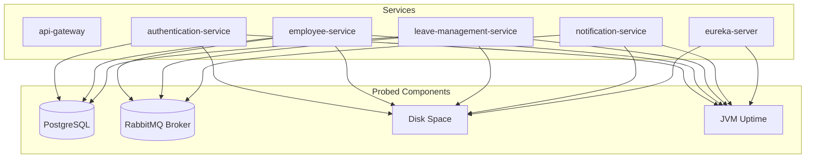

# Actuator Health Checks & Service Monitoring

In a microservices architecture, monitoring the health of individual services and their dependencies is essential to maintain stability and prevent traffic from routing to broken instances.

This document describes how Spring Boot Actuator health checks are implemented, configured, and exposed across the NAGP Leave Portal ecosystem.

---

## 1. Overview & Architecture

Each microservice exposes a `/actuator/health` endpoint on its respective port. Instead of a simple uptime check, the endpoint probes nested infrastructure dependencies to report a unified health status.



### Probed Resource Statuses
* **`db`** (PostgreSQL Connection): Checks database connectivity for Auth, Employee, and Leave services.
* **`rabbit`** (RabbitMQ Connection): Verifies message broker availability for Employee, Leave, and Notification services.
* **`diskSpace`**: Verifies that the host filesystem has enough free space (default threshold is 10MB).
* **`ping`**: A basic liveness probe indicating if the JVM process is responsive.

---

## 2. Health Check Endpoints

| Service | Active Port | Health Check URL |
| :--- | :--- | :--- |
| **API Gateway** | `8080` | `GET http://localhost:8080/actuator/health` |
| **Authentication Service** | `8081` | `GET http://localhost:8081/actuator/health` |
| **Employee Service** | `8082` | `GET http://localhost:8082/actuator/health` |
| **Leave Management Service** | `8083` | `GET http://localhost:8083/actuator/health` |
| **Notification Service** | `8084` | `GET http://localhost:8084/actuator/health` |
| **Eureka Server** | `8761` | `GET http://localhost:8761/actuator/health` |

---

## 3. Configuration & Implementation

### A. Maven Dependencies
The Actuator starter dependency is defined in the pom.xml of all microservice modules:
```xml
<dependency>
    <groupId>org.springframework.boot</groupId>
    <artifactId>spring-boot-starter-actuator</artifactId>
</dependency>
```

### B. Spring Configuration (application.yml)
To expose the endpoints and details, the following YAML settings are applied:
```yaml
management:
  endpoints:
    web:
      exposure:
        include: health,info
  endpoint:
    health:
      show-details: always
```
* **`exposure.include: health,info`**: Opens the `/actuator/health` and `/actuator/info` endpoints to web requests.
* **`show-details: always`**: Configures Actuator to output full details of individual probed components rather than a simple `{"status": "UP"}` object.

---

## 4. Sample Health Payload (`UP`)

When a service is fully functional, a request to its health endpoint returns an HTTP 200 status with details:

```json
{
  "status": "UP",
  "components": {
    "db": {
      "status": "UP",
      "details": {
        "database": "PostgreSQL",
        "validationQuery": "isValid()"
      }
    },
    "diskSpace": {
      "status": "UP",
      "details": {
        "total": 499963174912,
        "free": 430000000000,
        "threshold": 10485760
      }
    },
    "ping": {
      "status": "UP"
    },
    "rabbit": {
      "status": "UP",
      "details": {
        "version": "3.12.x"
      }
    }
  }
}
```

---

## 5. Dependency Failures (`DOWN`)

If a key dependency fails (e.g. RabbitMQ crashes or PostgreSQL becomes unreachable), Actuator handles the failure dynamically:
1. The failing component's status is set to `"DOWN"`.
2. The overall application status shifts to `"DOWN"`.
3. The server responds with an **HTTP 503 Service Unavailable** status code.

This HTTP 503 status code is immediately recognized by API Gateways, Service Registries (Eureka), and Container Orchestrators (like Kubernetes or Docker Compose), causing them to pull the service replica out of rotation or restart the container.
