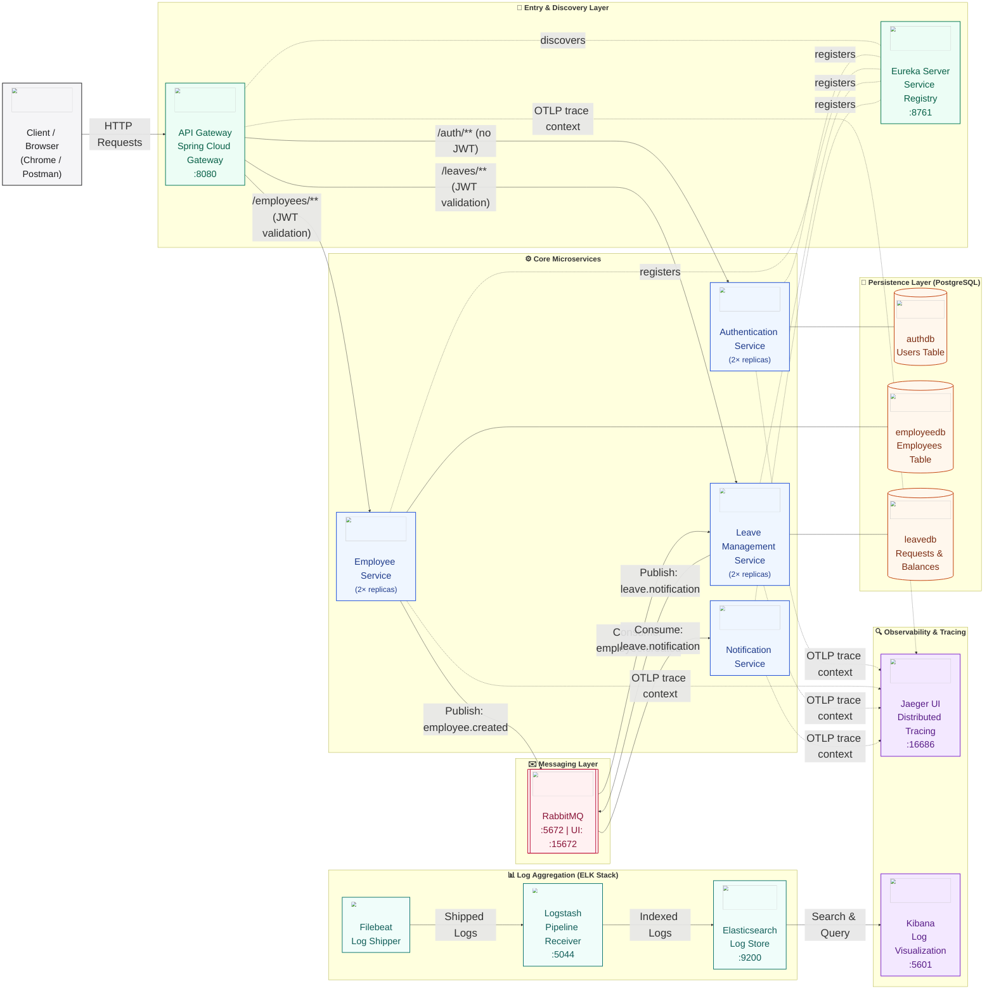
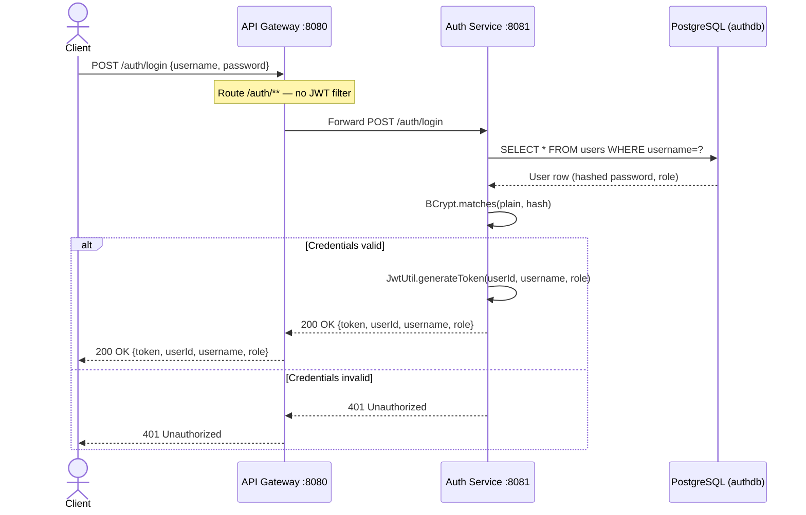
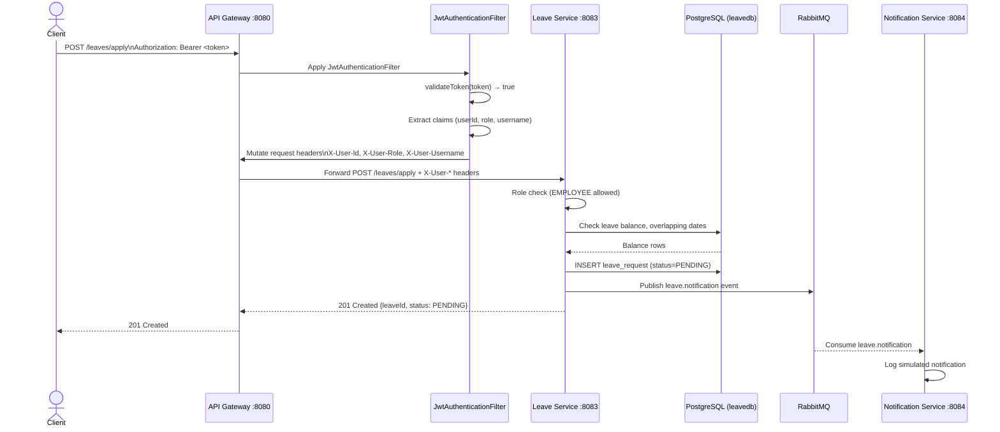
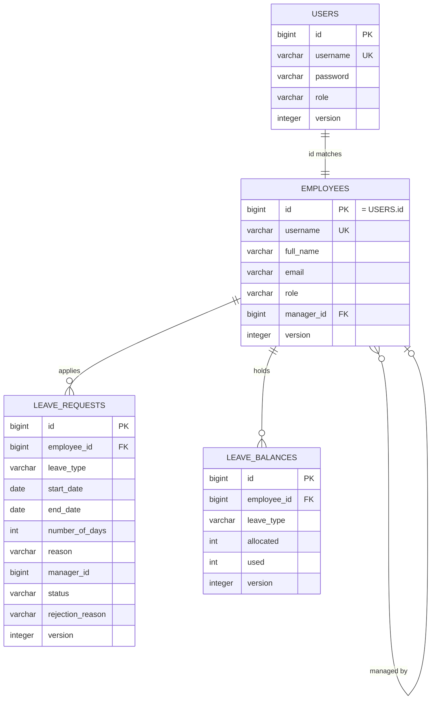
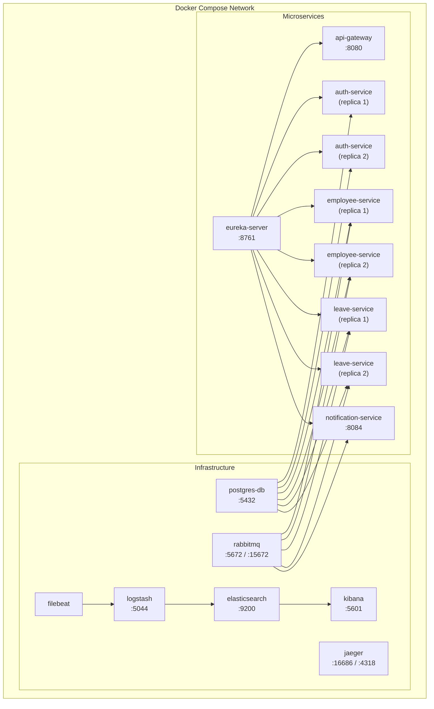

# Microservices Design Document
## Employee Leave Management Portal

> **Project:** NAGP 2026 — Employee Leave Management Portal  
> **Architecture:** Cloud-native Microservices  
> **Stack:** Java 17 · Spring Boot 3.2.5 · Spring Cloud 2023.0.1 · PostgreSQL · RabbitMQ · Docker

---

## Table of Contents

1. [System Overview](#1-system-overview)
2. [Architecture Diagram](#2-architecture-diagram)
3. [Service Inventory](#3-service-inventory)
4. [Service Detail Profiles](#4-service-detail-profiles)
5. [Data Model](#5-data-model)
6. [Inter-Service Communication](#6-inter-service-communication)
7. [Cross-Cutting Concerns](#7-cross-cutting-concerns)
8. [Deployment Architecture](#8-deployment-architecture)
9. [Technology Stack Summary](#9-technology-stack-summary)
10. [API Endpoints Reference](#10-api-endpoints-reference)

---

## 1. System Overview

The **Employee Leave Management Portal** is a demonstration-grade microservices system that allows employees to apply for leave and managers to approve or reject those requests. It is built to showcase real-world microservices patterns including service discovery, API gateway routing, JWT-based authentication, event-driven messaging, circuit breaking, distributed tracing, and centralized log aggregation.

### Design Principles

| Principle | Implementation |
|-----------|---------------|
| **Single Responsibility** | Each service owns one bounded context (auth, employees, leave, notifications) |
| **Database per Service** | Each service has its own isolated PostgreSQL schema |
| **API-First Gateway** | All client traffic enters through the API Gateway; no direct service calls |
| **Stateless Services** | JWT-based identity; no server-side session state |
| **Asynchronous Decoupling** | Side-effects (balance init, notifications) handled via RabbitMQ events |
| **Observability** | Structured JSON logs (ELK), distributed traces (OpenTelemetry + Jaeger), health endpoints |
| **Resilience** | Circuit breakers (Resilience4j) on all gateway routes |

---

## 2. Architecture Diagram

### 2.1 Full System Architecture



### 2.2 Request Flow — Authentication



### 2.3 Request Flow — Authenticated API Call



---

## 3. Service Inventory

| Service | Artifact ID | Port | Replicas | Role |
|---------|-------------|:----:|:--------:|------|
| [Eureka Server](../eureka-server) | `eureka-server` | `8761` | 1 | Service registry |
| [API Gateway](../api-gateway) | `api-gateway` | `8080` | 1 | Entry point, JWT enforcement, circuit breaking |
| [Authentication Service](../authentication-service) | `authentication-service` | `8081` | **2** | User auth, JWT issuance |
| [Employee Service](../employee-service) | `employee-service` | `8082` | **2** | Employee profiles, RBAC |
| [Leave Management Service](../leave-management-service) | `leave-management-service` | `8083` | **2** | Leave lifecycle, balance management |
| [Notification Service](../notification-service) | `notification-service` | `8084` | 1 | Simulated notification consumer |
| **Infrastructure** | | | | |
| PostgreSQL | — | `5432` | 1 | Persistent storage (3 schemas) |
| RabbitMQ | — | `5672` / `15672` | 1 | Async event broker |
| Jaeger | — | `16686` | 1 | Distributed trace UI |
| Elasticsearch | — | `9200` | 1 | Log index store |
| Logstash | — | `5044` | 1 | Log pipeline |
| Kibana | — | `5601` | 1 | Log visualization |
| Filebeat | — | — | 1 | Log shipper (Docker-aware) |

---

## 4. Service Detail Profiles

### 4.1 Eureka Server (`eureka-server`)

- **Technology:** Spring Cloud Netflix Eureka Server
- **Responsibility:** All microservices register themselves with Eureka at startup with their IP address and port. The API Gateway queries Eureka to resolve service names (e.g. `EMPLOYEE-SERVICE`) to live instance addresses, enabling client-side load balancing with no hardcoded hostnames.
- **Key config:** `prefer-ip-address: true` on all clients (important for Docker container networking)
- **UI:** http://localhost:8761

---

### 4.2 API Gateway (`api-gateway`)

- **Technology:** Spring Cloud Gateway (reactive, WebFlux-based)
- **Responsibility:**
  - Single entry point for all external HTTP traffic
  - JWT validation via [`JwtAuthenticationFilter`](/api-gateway/src/main/java/com/niloy/gateway/filter/JwtAuthenticationFilter.java)
  - Propagates identity as trusted headers (`X-User-Id`, `X-User-Role`, `X-User-Username`)
  - Circuit breaker wrapping on every route (Resilience4j)
  - Fallback endpoints for degraded-mode responses

**Route Table:**

| Route ID | Path Pattern | JWT Required | Circuit Breaker |
|----------|-------------|:------------:|:---------------:|
| `authentication-service` | `/auth/**` | ❌ | `authServiceCB` |
| `employee-service` | `/employees/**` | ✅ | `employeeServiceCB` |
| `leave-management-service` | `/leaves/**` | ✅ | `leaveServiceCB` |

**Circuit Breaker Configuration:**

| Breaker | Window Size | Min Calls | Failure Threshold | Wait (Open) |
|---------|:-----------:|:---------:|:-----------------:|:-----------:|
| `authServiceCB` | 10 | 5 | 50% | 10s |
| `employeeServiceCB` | 20 | 10 | 50% | 5s |
| `leaveServiceCB` | 20 | 10 | 50% | 5s |

---

### 4.3 Authentication Service (`authentication-service`)

- **Technology:** Spring Boot · Spring Security · Spring Data JPA · PostgreSQL · JJWT
- **Database:** `authdb` (schema: `users`)
- **Responsibility:**
  - Validates username/password against BCrypt-hashed passwords
  - Issues signed JWT tokens (HS256, 24-hour expiry)
  - Provides the single public endpoint (`POST /auth/login`)

**Seeded Test Credentials:**

| Username | Password | Role |
|----------|----------|------|
| `employee1` | `password` | `EMPLOYEE` |
| `employee2` | `password` | `EMPLOYEE` |
| `manager1` | `password` | `MANAGER` |

**JWT Claims:**

| Claim | Value |
|-------|-------|
| `sub` | User ID (string) |
| `role` | `EMPLOYEE` or `MANAGER` |
| `username` | Authenticated username |
| `iat` | Issued-at timestamp |
| `exp` | Expiry (iat + 24 hours) |

---

### 4.4 Employee Service (`employee-service`)

- **Technology:** Spring Boot · Spring Data JPA · Spring AMQP · PostgreSQL · OpenTelemetry
- **Database:** `employeedb` (schema: `employees`)
- **Responsibility:**
  - CRUD for employee profiles
  - Enforces role-based access (only `MANAGER` can create employees; `EMPLOYEE` can only view their own record)
  - Publishes `employee.created` event to RabbitMQ after each new employee is persisted

**Identity Link:** The `Employee.id` is manually set to match the `User.id` from the authentication service. This is the shared identity key across the system.

**Seeded Employees (startup):**

| ID | Username | Full Name | Role | Manager ID |
|----|----------|-----------|------|:----------:|
| 1 | employee1 | Employee One | EMPLOYEE | 3 |
| 2 | employee2 | Employee Two | EMPLOYEE | 3 |
| 3 | manager1 | Manager One | MANAGER | — |

> [!NOTE]
> **Reporting Hierarchy & Manager Leave Approvals:**
> * **Root Node (`manager1`)**: In this minimal seed dataset, `manager1` represents the root of the hierarchy and reports to no one, which is why their `Manager ID` is empty (`null` in the database).
> * **Database Constraints**: The `managerId` field in the leave requests database is non-nullable (`NOT NULL`). Therefore, if a manager applies for leave, they must still provide a valid numeric value for `managerId` in the request body.
> * **Self-Approval vs. Hierarchy**: The `leave-management-service` verifies that the approver has the `MANAGER` role and that their ID matches the request's `managerId`. Because there is no check preventing the requester and approver from being the same person, a manager can self-approve their request by setting the `managerId` to their own ID. In production, this field would instead point to a higher-ranking manager (e.g., a Director).

---

### 4.5 Leave Management Service (`leave-management-service`)

- **Technology:** Spring Boot · Spring Data JPA · Spring AMQP · PostgreSQL · OpenTelemetry
- **Database:** `leavedb` (schemas: `leave_requests`, `leave_balances`)
- **Responsibility:**
  - Consumes `employee.created` events → initializes leave balances
  - Processes leave applications with business rule validation
  - Manages the full leave lifecycle (PENDING → APPROVED / REJECTED / CANCELLED)
  - Publishes `leave.notification` events on every status transition

**Business Validation Rules:**

| Rule | Condition | Response |
|------|-----------|----------|
| Past date check | `startDate` is before today | 400 Bad Request |
| Balance check | Requested days > remaining balance | 400 Bad Request |
| Overlap check | Dates overlap with existing PENDING/APPROVED request | 409 Conflict |
| Role guard (approve) | Caller role ≠ `MANAGER` | 403 Forbidden |
| Role guard (apply) | Caller role ≠ `EMPLOYEE` | 403 Forbidden |

**Default Leave Allocations (per new employee):**

| Leave Type | Allocated Days |
|------------|:--------------:|
| `CASUAL` | 12 |
| `SICK` | 10 |
| `PRIVILEGE` | 15 |

---

### 4.6 Notification Service (`notification-service`)

- **Technology:** Spring Boot · Spring AMQP · OpenTelemetry
- **No database** — stateless consumer
- **Responsibility:**
  - Consumes `leave.notification` events from RabbitMQ
  - Formats and logs a structured notification entry to stdout (simulated email/SMS)
  - No external integrations — designed as an extensibility point for real notification providers

---

## 5. Data Model

### 5.1 Entity-Relationship Diagram



### 5.2 Database Isolation

Each service owns exactly one PostgreSQL database schema — they share the same PostgreSQL *server* but have entirely separate databases:

| Service | Database | Tables |
|---------|----------|--------|
| `authentication-service` | `authdb` | `users` |
| `employee-service` | `employeedb` | `employees` |
| `leave-management-service` | `leavedb` | `leave_requests`, `leave_balances` |

> No service can query another service's database directly. Cross-service data needs are satisfied only through API calls or messaging events.

### 5.3 Optimistic Locking

All JPA entities carry a `@Version` (`INTEGER`) column. Spring Data JPA uses this for optimistic locking — concurrent updates to the same record are detected and rejected with an `ObjectOptimisticLockingFailureException`, preventing lost updates without database-level row locks.

---

## 6. Inter-Service Communication

The system implements a hybrid communication architecture consisting of synchronous requests and asynchronous events:

1. **Synchronous HTTP**: Used for client-facing API requests, routed and load-balanced via Spring Cloud Gateway.
2. **Asynchronous Messaging**: Used for decoupling cross-service operations and side effects, implemented via RabbitMQ Topic Exchanges.

> [!NOTE]
> For the complete details of the communication patterns, RabbitMQ topology, message payloads, and schema details, see the dedicated writeup in [inter_service_communication.md](inter_service_communication.md).

### 6.1 Architectural Assumptions

1. **Shared Identity Key:** `User.id` (auth) = `Employee.id` (employee) = `LeaveRequest.employeeId` (leave). The manager who creates an employee profile supplies the ID that matches the authentication record.
2. **Eventual Consistency:** Leave balance initialization is asynchronous. The `POST /employees` call returns `201` immediately; balances appear after the `employee.created` event is consumed.
3. **Gateway as Trust Boundary:** Downstream services trust `X-User-*` headers unconditionally. They assume the gateway has already validated the JWT — no downstream JWT parsing occurs.

---

## 7. Cross-Cutting Concerns

### 7.1 Authentication & Authorization

> [!NOTE]
> See the full document: [authentication_and_authorization.md](cross-cutting-concerns/authentication_and_authorization.md)

| Concern | Where Implemented | Mechanism |
|---------|------------------|-----------|
| Authentication | `authentication-service` | BCrypt password check → JWT issuance |
| Gateway-level AuthZ | `api-gateway` | `JwtAuthenticationFilter` → validates JWT, injects headers |
| Service-level AuthZ | `employee-service`, `leave-management-service` | Read `X-User-Role` header, enforce RBAC |


### 7.2 Circuit Breaker

> [!NOTE]
> See the full document: [circuit_breaker_pattern.md](cross-cutting-concerns/circuit_breaker_pattern.md)

- **Library:** Resilience4j (via `spring-cloud-starter-circuitbreaker-reactor-resilience4j`)
- **Scope:** All three downstream routes in the API Gateway
- **States:** `CLOSED` → `OPEN` (after threshold) → `HALF-OPEN` (after wait) → `CLOSED`
- **Fallback:** Each route has a dedicated fallback endpoint in [`FallbackController`](/api-gateway/src/main/java/com/niloy/gateway/controller/FallbackController.java) that returns a structured `503 Service Unavailable` response


### 7.3 Distributed Tracing

> [!NOTE]
> See the full document: [distributed_tracing.md](cross-cutting-concerns/distributed_tracing.md)

- **Library:** Micrometer Tracing + OpenTelemetry (OTLP exporter)
- **Backend:** Jaeger (`http://jaeger:4318/v1/traces`)
- **Sampling:** 100% (`probability: 1.0`) — every request is traced
- **Coverage:** All 5 microservices export `traceId` + `spanId`
- **UI:** http://localhost:16686


### 7.4 Structured Logging & ELK Stack

> [!NOTE]
> See the full document: [logging.md](cross-cutting-concerns/logging.md) · [elk_stack_centralized_logging.md](elk_stack_centralized_logging.md)

- **Library:** SLF4J + Logback + `logstash-logback-encoder`
- **Format:** JSON (machine-readable, with `traceId`, `spanId`, service name, timestamp)
- **Pipeline:** Service → JSON log file → Filebeat → Logstash → Elasticsearch → Kibana
- **Kibana:** http://localhost:5601


### 7.5 Global Exception Handling

> [!NOTE]
> See the full document: [global_exception_handling.md](cross-cutting-concerns/global_exception_handling.md)


### 7.6 Health & Actuator Endpoints

> [!NOTE]
> See the full document: [health_checks.md](health_checks.md)

---

## 8. Deployment Architecture

### 8.1 Docker Compose Services

The entire stack runs as Docker containers defined in [`docker-compose.yml`](/docker-compose.yml):



### 8.2 Startup Order & Dependencies

| Service | Waits For |
|---------|-----------|
| `postgres-db` | *(starts first)* — health check: `pg_isready` |
| `elasticsearch` | *(starts first)* — health check: `curl :9200` |
| `eureka-server` | No hard dependency |
| `rabbitmq` | No hard dependency |
| `api-gateway` | `eureka-server` |
| `authentication-service` | `eureka-server` (started) + `postgres-db` (healthy) |
| `employee-service` | `eureka-server` + `rabbitmq` + `postgres-db` (healthy) |
| `leave-management-service` | `eureka-server` + `rabbitmq` + `postgres-db` (healthy) |
| `notification-service` | `eureka-server` + `rabbitmq` |
| `logstash` | `elasticsearch` (healthy) |
| `kibana` | `elasticsearch` (healthy) |
| `filebeat` | `logstash` |

### 8.3 Docker Images

All service images are built from their respective `Dockerfile` and tagged under the `dreamspace04` Docker Hub namespace:

| Image | Tag |
|-------|-----|
| `dreamspace04/eureka-server` | `latest` |
| `dreamspace04/api-gateway` | `latest` |
| `dreamspace04/authentication-service` | `latest` |
| `dreamspace04/employee-service` | `latest` |
| `dreamspace04/leave-management-service` | `latest` |
| `dreamspace04/notification-service` | `latest` |

### 8.4 Running the Stack

```bash
# Build and start all services
docker-compose up --build

# Start in detached mode
docker-compose up -d --build

# Stop and remove containers
docker-compose down

# View logs for a specific service
docker-compose logs -f leave-management-service

# Scale a service (example: 3 auth replicas)
docker-compose up --scale authentication-service=3
```

---

## 9. Technology Stack Summary

| Category | Technology | Scope |
|----------|-----------|---------|
| Language | Java | All services |
| Build tool | Apache Maven | All services |
| Framework | Spring Boot | All services |
| Service discovery | Spring Cloud Netflix Eureka | All services |
| API Gateway | Spring Cloud Gateway | `api-gateway` |
| Messaging | Spring AMQP (RabbitMQ) | Employee, Leave, Notification |
| Persistence | Spring Data JPA + Hibernate | Auth, Employee, Leave |
| Security | Spring Security | Auth |
| JWT | JJWT | Auth, Gateway |
| Circuit Breaker | Resilience4j | Gateway |
| Tracing | Micrometer + OpenTelemetry | All services |
| Trace backend | Jaeger | Infrastructure |
| Logging | SLF4J + Logback | All services |
| Log encoder | logstash-logback-encoder | All services |
| Log pipeline | Filebeat + Logstash + Elasticsearch + Kibana | Infrastructure |
| Database | PostgreSQL | Auth, Employee, Leave |
| Message broker | RabbitMQ | Infrastructure |
| Containerization | Docker + Docker Compose | Deployment |
| Utility | Lombok | All services |

---

## 10. API Endpoints Reference

For the detailed specifications of all REST API endpoints, query parameters, request headers, and response payloads, please refer to the dedicated [API Endpoints Reference](api_endpoints.md) document.

