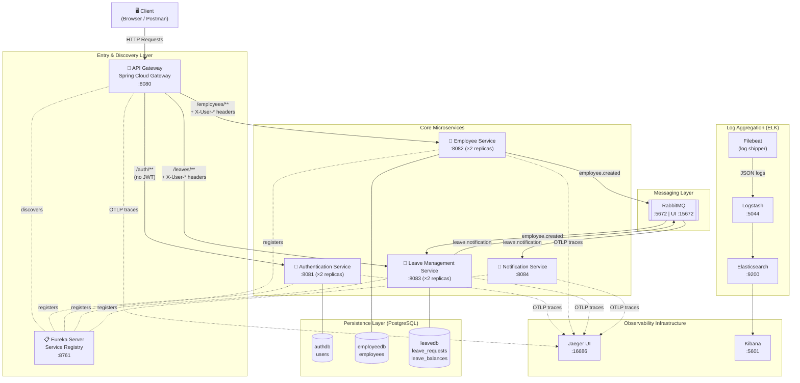
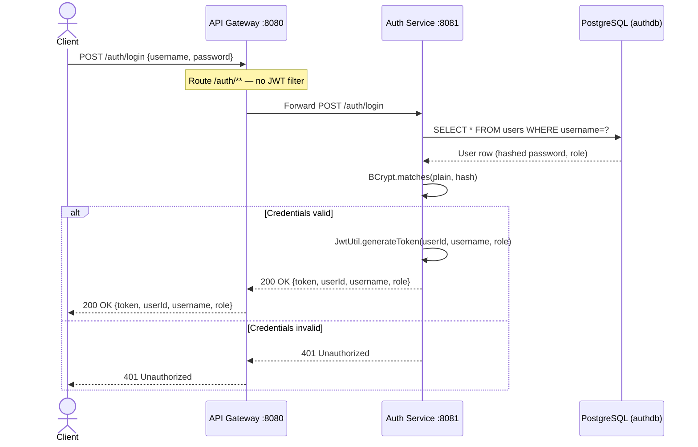
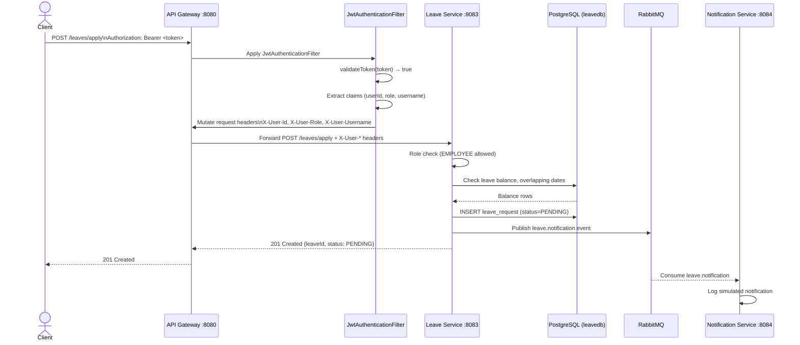
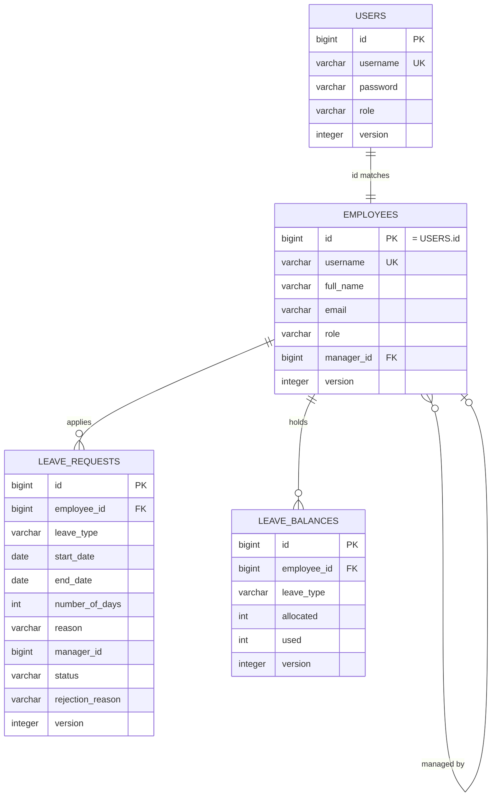
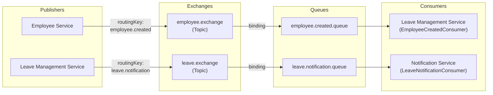
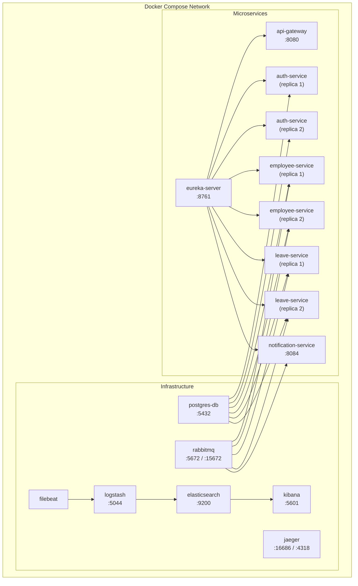

# Microservices Design Document
## Employee Leave Management Portal

> **Project:** NAGP 2026 — Employee Leave Management Portal  
> **Architecture:** Cloud-native Microservices  
> **Stack:** Java 17 · Spring Boot 3.2.5 · Spring Cloud 2023.0.1 · PostgreSQL · RabbitMQ · Docker

---

## Table of Contents

1. [System Overview](#1-system-overview)
2. [Architecture Diagram](#2-architecture-diagram)
3. [Service Inventory](#3-service-inventory)
4. [Service Detail Profiles](#4-service-detail-profiles)
5. [Data Model](#5-data-model)
6. [Inter-Service Communication](#6-inter-service-communication)
7. [Cross-Cutting Concerns](#7-cross-cutting-concerns)
8. [Deployment Architecture](#8-deployment-architecture)
9. [Technology Stack Summary](#9-technology-stack-summary)
10. [API Endpoints Reference](#10-api-endpoints-reference)

---

## 1. System Overview

The **Employee Leave Management Portal** is a demonstration-grade microservices system that allows employees to apply for leave and managers to approve or reject those requests. It is built to showcase real-world microservices patterns including service discovery, API gateway routing, JWT-based authentication, event-driven messaging, circuit breaking, distributed tracing, and centralized log aggregation.

### Design Principles

| Principle | Implementation |
|-----------|---------------|
| **Single Responsibility** | Each service owns one bounded context (auth, employees, leave, notifications) |
| **Database per Service** | Each service has its own isolated PostgreSQL schema |
| **API-First Gateway** | All client traffic enters through the API Gateway; no direct service calls |
| **Stateless Services** | JWT-based identity; no server-side session state |
| **Asynchronous Decoupling** | Side-effects (balance init, notifications) handled via RabbitMQ events |
| **Observability** | Structured JSON logs (ELK), distributed traces (OpenTelemetry + Jaeger), health endpoints |
| **Resilience** | Circuit breakers (Resilience4j) on all gateway routes |

---

## 2. Architecture Diagram

### 2.1 Full System Architecture



### 2.2 Request Flow — Authentication



### 2.3 Request Flow — Authenticated API Call



---

## 3. Service Inventory

| Service | Artifact ID | Port | Replicas | Role |
|---------|-------------|:----:|:--------:|------|
| [Eureka Server](../eureka-server) | `eureka-server` | `8761` | 1 | Service registry |
| [API Gateway](../api-gateway) | `api-gateway` | `8080` | 1 | Entry point, JWT enforcement, circuit breaking |
| [Authentication Service](../authentication-service) | `authentication-service` | `8081` | **2** | User auth, JWT issuance |
| [Employee Service](../employee-service) | `employee-service` | `8082` | **2** | Employee profiles, RBAC |
| [Leave Management Service](../leave-management-service) | `leave-management-service` | `8083` | **2** | Leave lifecycle, balance management |
| [Notification Service](../notification-service) | `notification-service` | `8084` | 1 | Simulated notification consumer |
| **Infrastructure** | | | | |
| PostgreSQL | — | `5432` | 1 | Persistent storage (3 schemas) |
| RabbitMQ | — | `5672` / `15672` | 1 | Async event broker |
| Jaeger | — | `16686` | 1 | Distributed trace UI |
| Elasticsearch | — | `9200` | 1 | Log index store |
| Logstash | — | `5044` | 1 | Log pipeline |
| Kibana | — | `5601` | 1 | Log visualization |
| Filebeat | — | — | 1 | Log shipper (Docker-aware) |

---

## 4. Service Detail Profiles

### 4.1 Eureka Server (`eureka-server`)

- **Technology:** Spring Cloud Netflix Eureka Server
- **Responsibility:** All microservices register themselves with Eureka at startup with their IP address and port. The API Gateway queries Eureka to resolve service names (e.g. `EMPLOYEE-SERVICE`) to live instance addresses, enabling client-side load balancing with no hardcoded hostnames.
- **Key config:** `prefer-ip-address: true` on all clients (important for Docker container networking)
- **UI:** http://localhost:8761

---

### 4.2 API Gateway (`api-gateway`)

- **Technology:** Spring Cloud Gateway (reactive, WebFlux-based)
- **Responsibility:**
  - Single entry point for all external HTTP traffic
  - JWT validation via [`JwtAuthenticationFilter`](/api-gateway/src/main/java/com/niloy/gateway/filter/JwtAuthenticationFilter.java)
  - Propagates identity as trusted headers (`X-User-Id`, `X-User-Role`, `X-User-Username`)
  - Circuit breaker wrapping on every route (Resilience4j)
  - Fallback endpoints for degraded-mode responses

**Route Table:**

| Route ID | Path Pattern | JWT Required | Circuit Breaker |
|----------|-------------|:------------:|:---------------:|
| `authentication-service` | `/auth/**` | ❌ | `authServiceCB` |
| `employee-service` | `/employees/**` | ✅ | `employeeServiceCB` |
| `leave-management-service` | `/leaves/**` | ✅ | `leaveServiceCB` |

**Circuit Breaker Configuration:**

| Breaker | Window Size | Min Calls | Failure Threshold | Wait (Open) |
|---------|:-----------:|:---------:|:-----------------:|:-----------:|
| `authServiceCB` | 10 | 5 | 50% | 10s |
| `employeeServiceCB` | 20 | 10 | 50% | 5s |
| `leaveServiceCB` | 20 | 10 | 50% | 5s |

---

### 4.3 Authentication Service (`authentication-service`)

- **Technology:** Spring Boot · Spring Security · Spring Data JPA · PostgreSQL · JJWT
- **Database:** `authdb` (schema: `users`)
- **Responsibility:**
  - Validates username/password against BCrypt-hashed passwords
  - Issues signed JWT tokens (HS256, 24-hour expiry)
  - Provides the single public endpoint (`POST /auth/login`)

**Seeded Test Credentials:**

| Username | Password | Role |
|----------|----------|------|
| `employee1` | `password` | `EMPLOYEE` |
| `employee2` | `password` | `EMPLOYEE` |
| `manager1` | `password` | `MANAGER` |

**JWT Claims:**

| Claim | Value |
|-------|-------|
| `sub` | User ID (string) |
| `role` | `EMPLOYEE` or `MANAGER` |
| `username` | Authenticated username |
| `iat` | Issued-at timestamp |
| `exp` | Expiry (iat + 24 hours) |

---

### 4.4 Employee Service (`employee-service`)

- **Technology:** Spring Boot · Spring Data JPA · Spring AMQP · PostgreSQL · OpenTelemetry
- **Database:** `employeedb` (schema: `employees`)
- **Responsibility:**
  - CRUD for employee profiles
  - Enforces role-based access (only `MANAGER` can create employees; `EMPLOYEE` can only view their own record)
  - Publishes `employee.created` event to RabbitMQ after each new employee is persisted

**Identity Link:** The `Employee.id` is manually set to match the `User.id` from the authentication service. This is the shared identity key across the system.

**Seeded Employees (startup):**

| ID | Username | Full Name | Role | Manager ID |
|----|----------|-----------|------|:----------:|
| 1 | employee1 | Employee One | EMPLOYEE | 3 |
| 2 | employee2 | Employee Two | EMPLOYEE | 3 |
| 3 | manager1 | Manager One | MANAGER | — |

---

### 4.5 Leave Management Service (`leave-management-service`)

- **Technology:** Spring Boot · Spring Data JPA · Spring AMQP · PostgreSQL · OpenTelemetry
- **Database:** `leavedb` (schemas: `leave_requests`, `leave_balances`)
- **Responsibility:**
  - Consumes `employee.created` events → initializes leave balances
  - Processes leave applications with business rule validation
  - Manages the full leave lifecycle (PENDING → APPROVED / REJECTED / CANCELLED)
  - Publishes `leave.notification` events on every status transition

**Business Validation Rules:**

| Rule | Condition | Response |
|------|-----------|----------|
| Past date check | `startDate` is before today | 400 Bad Request |
| Balance check | Requested days > remaining balance | 400 Bad Request |
| Overlap check | Dates overlap with existing PENDING/APPROVED request | 409 Conflict |
| Role guard (approve) | Caller role ≠ `MANAGER` | 403 Forbidden |
| Role guard (apply) | Caller role ≠ `EMPLOYEE` | 403 Forbidden |

**Default Leave Allocations (per new employee):**

| Leave Type | Allocated Days |
|------------|:--------------:|
| `CASUAL` | 12 |
| `SICK` | 10 |
| `PRIVILEGE` | 15 |

---

### 4.6 Notification Service (`notification-service`)

- **Technology:** Spring Boot · Spring AMQP · OpenTelemetry
- **No database** — stateless consumer
- **Responsibility:**
  - Consumes `leave.notification` events from RabbitMQ
  - Formats and logs a structured notification entry to stdout (simulated email/SMS)
  - No external integrations — designed as an extensibility point for real notification providers

---

## 5. Data Model

### 5.1 Entity-Relationship Diagram



### 5.2 Database Isolation

Each service owns exactly one PostgreSQL database schema — they share the same PostgreSQL *server* but have entirely separate databases:

| Service | Database | Tables |
|---------|----------|--------|
| `authentication-service` | `authdb` | `users` |
| `employee-service` | `employeedb` | `employees` |
| `leave-management-service` | `leavedb` | `leave_requests`, `leave_balances` |

> No service can query another service's database directly. Cross-service data needs are satisfied only through API calls or messaging events.

### 5.3 Optimistic Locking

All JPA entities carry a `@Version` (`INTEGER`) column. Spring Data JPA uses this for optimistic locking — concurrent updates to the same record are detected and rejected with an `ObjectOptimisticLockingFailureException`, preventing lost updates without database-level row locks.

---

## 6. Inter-Service Communication

### 6.1 Communication Patterns

| Pattern | Used For | Technology |
|---------|----------|-----------|
| **Synchronous HTTP** | Client-facing API calls | Spring Cloud Gateway (load-balanced `lb://` URIs) |
| **Asynchronous Messaging** | Cross-service side effects | RabbitMQ Topic Exchange |

### 6.2 RabbitMQ Event Topology



### 6.3 Event Contracts

**`employee.created` event:**
```json
{
  "employeeId": 4,
  "username": "employee3",
  "fullName": "Employee Three",
  "email": "employee3@company.com",
  "managerId": 3
}
```
**Consumer action:** Leave Management Service initializes `CASUAL=12`, `SICK=10`, `PRIVILEGE=15` balance rows for the new employee.

---

**`leave.notification` event:**
```json
{
  "eventType": "APPLICATION",
  "employeeId": 1,
  "employeeName": "employee1",
  "managerId": 3,
  "leaveId": 1,
  "leaveType": "CASUAL",
  "startDate": "2026-06-01",
  "endDate": "2026-06-03",
  "numberOfDays": 3,
  "status": "PENDING",
  "comments": "Applied successfully: Personal trip"
}
```

**`eventType` values:** `APPLICATION`, `APPROVED`, `REJECTED`, `CANCELLED`  
**Consumer action:** Notification Service logs a formatted simulated notification to stdout.

### 6.4 Architectural Assumptions

1. **Shared Identity Key:** `User.id` (auth) = `Employee.id` (employee) = `LeaveRequest.employeeId` (leave). The manager who creates an employee profile supplies the ID that matches the authentication record.
2. **Eventual Consistency:** Leave balance initialization is asynchronous. The `POST /employees` call returns `201` immediately; balances appear after the `employee.created` event is consumed.
3. **Gateway as Trust Boundary:** Downstream services trust `X-User-*` headers unconditionally. They assume the gateway has already validated the JWT — no downstream JWT parsing occurs.

---

## 7. Cross-Cutting Concerns

### 7.1 Authentication & Authorization

See the full document: [authentication_and_authorization.md](cross-cutting-concerns/authentication_and_authorization.md)

| Concern | Where Implemented | Mechanism |
|---------|------------------|-----------|
| Authentication | `authentication-service` | BCrypt password check → JWT issuance |
| Gateway-level AuthZ | `api-gateway` | `JwtAuthenticationFilter` → validates JWT, injects headers |
| Service-level AuthZ | `employee-service`, `leave-management-service` | Read `X-User-Role` header, enforce RBAC |

**Role permissions summary:**

| Action | EMPLOYEE | MANAGER |
|--------|:--------:|:-------:|
| Login | ✅ | ✅ |
| View own employee record | ✅ | ✅ |
| View any employee record | ❌ | ✅ |
| Create employee | ❌ | ✅ |
| Apply for leave | ✅ | ❌ |
| Approve/Reject leave | ❌ | ✅ |
| Cancel leave | ✅ | ❌ |

---

### 7.2 Circuit Breaker

See the full document: [circuit_breaker_pattern.md](cross-cutting-concerns/circuit_breaker_pattern.md)

- **Library:** Resilience4j (via `spring-cloud-starter-circuitbreaker-reactor-resilience4j`)
- **Scope:** All three downstream routes in the API Gateway
- **States:** `CLOSED` → `OPEN` (after threshold) → `HALF-OPEN` (after wait) → `CLOSED`
- **Fallback:** Each route has a dedicated fallback endpoint in [`FallbackController`](/api-gateway/src/main/java/com/niloy/gateway/controller/FallbackController.java) that returns a structured `503 Service Unavailable` response

---

### 7.3 Distributed Tracing

See the full document: [distributed_tracing.md](cross-cutting-concerns/distributed_tracing.md)

- **Library:** Micrometer Tracing + OpenTelemetry (OTLP exporter)
- **Backend:** Jaeger (`http://jaeger:4318/v1/traces`)
- **Sampling:** 100% (`probability: 1.0`) — every request is traced
- **Coverage:** All 5 microservices export `traceId` + `spanId`
- **UI:** http://localhost:16686

---

### 7.4 Structured Logging & ELK Stack

See the full document: [logging.md](cross-cutting-concerns/logging.md) · [elk_stack_centralized_logging.md](elk_stack_centralized_logging.md)

- **Library:** SLF4J + Logback + `logstash-logback-encoder`
- **Format:** JSON (machine-readable, with `traceId`, `spanId`, service name, timestamp)
- **Pipeline:** Service → JSON log file → Filebeat → Logstash → Elasticsearch → Kibana
- **Kibana:** http://localhost:5601

Log level configuration across all services:

```yaml
logging:
  level:
    root: INFO
    com.niloy: DEBUG       # full debug for all project code
    org.springframework: WARN
    org.hibernate: WARN
```

---

### 7.5 Global Exception Handling

See the full document: [global_exception_handling.md](cross-cutting-concerns/global_exception_handling.md)

All services use `@RestControllerAdvice` to produce consistent error response shapes:

```json
{
  "status": 401,
  "error": "Unauthorized",
  "message": "Invalid username or password",
  "timestamp": "2026-05-30T10:22:01"
}
```

---

### 7.6 Health & Actuator Endpoints

See the full document: [health_checks.md](health_checks.md)

All services expose Spring Boot Actuator endpoints:

| Endpoint | Path |
|----------|------|
| Health | `/actuator/health` |
| Info | `/actuator/info` |
| Circuit Breakers | `/actuator/circuitbreakers` (gateway only) |

---

## 8. Deployment Architecture

### 8.1 Docker Compose Services

The entire stack runs as Docker containers defined in [`docker-compose.yml`](/docker-compose.yml):



### 8.2 Startup Order & Dependencies

| Service | Waits For |
|---------|-----------|
| `postgres-db` | *(starts first)* — health check: `pg_isready` |
| `elasticsearch` | *(starts first)* — health check: `curl :9200` |
| `eureka-server` | No hard dependency |
| `rabbitmq` | No hard dependency |
| `api-gateway` | `eureka-server` |
| `authentication-service` | `eureka-server` (started) + `postgres-db` (healthy) |
| `employee-service` | `eureka-server` + `rabbitmq` + `postgres-db` (healthy) |
| `leave-management-service` | `eureka-server` + `rabbitmq` + `postgres-db` (healthy) |
| `notification-service` | `eureka-server` + `rabbitmq` |
| `logstash` | `elasticsearch` (healthy) |
| `kibana` | `elasticsearch` (healthy) |
| `filebeat` | `logstash` |

### 8.3 Docker Images

All service images are built from their respective `Dockerfile` and tagged under the `dreamspace04` Docker Hub namespace:

| Image | Tag |
|-------|-----|
| `dreamspace04/eureka-server` | `latest` |
| `dreamspace04/api-gateway` | `latest` |
| `dreamspace04/authentication-service` | `latest` |
| `dreamspace04/employee-service` | `latest` |
| `dreamspace04/leave-management-service` | `latest` |
| `dreamspace04/notification-service` | `latest` |

### 8.4 Running the Stack

```bash
# Build and start all services
docker-compose up --build

# Start in detached mode
docker-compose up -d --build

# Stop and remove containers
docker-compose down

# View logs for a specific service
docker-compose logs -f leave-management-service

# Scale a service (example: 3 auth replicas)
docker-compose up --scale authentication-service=3
```

---

## 9. Technology Stack Summary

| Category | Technology | Version | Scope |
|----------|-----------|---------|-------|
| Language | Java | 17 | All services |
| Build tool | Apache Maven | 3.x | All services |
| Framework | Spring Boot | 3.2.5 | All services |
| Service discovery | Spring Cloud Netflix Eureka | 2023.0.1 | All services |
| API Gateway | Spring Cloud Gateway | 2023.0.1 | `api-gateway` |
| Messaging | Spring AMQP (RabbitMQ) | 3.x | Employee, Leave, Notification |
| Persistence | Spring Data JPA + Hibernate | 3.2.5 | Auth, Employee, Leave |
| Security | Spring Security | 6.x | Auth |
| JWT | JJWT | 0.11.5 | Auth, Gateway |
| Circuit Breaker | Resilience4j | 2.1.0 | Gateway |
| Tracing | Micrometer + OpenTelemetry | — | All services |
| Trace backend | Jaeger | 1.50 | Infrastructure |
| Logging | SLF4J + Logback | — | All services |
| Log encoder | logstash-logback-encoder | 7.4 | All services |
| Log pipeline | Filebeat + Logstash + Elasticsearch + Kibana | 8.13.0 | Infrastructure |
| Database | PostgreSQL | 15 | Auth, Employee, Leave |
| Message broker | RabbitMQ | 3-management | Infrastructure |
| Containerization | Docker + Docker Compose | 3.8 | Deployment |
| Utility | Lombok | — | All services |

---

## 10. API Endpoints Reference

### Authentication Service (`/auth`)

| Method | Path | Auth | Role | Description |
|--------|------|:----:|------|-------------|
| `POST` | `/auth/login` | ❌ | Any | Validate credentials, return JWT |

### Employee Service (`/employees`)

| Method | Path | Auth | Role | Description |
|--------|------|:----:|------|-------------|
| `POST` | `/employees` | ✅ | MANAGER | Create new employee profile |
| `GET` | `/employees/{id}` | ✅ | Any\* | Get employee by ID |
| `GET` | `/employees` | ✅ | MANAGER | List all employees |

> \*`EMPLOYEE` role can only retrieve their own record (`id` must match `X-User-Id`)

### Leave Management Service (`/leaves`)

| Method | Path | Auth | Role | Description |
|--------|------|:----:|------|-------------|
| `POST` | `/leaves/apply` | ✅ | EMPLOYEE | Submit a new leave request |
| `GET` | `/leaves/{id}` | ✅ | Any | Get leave request by ID |
| `GET` | `/leaves/my` | ✅ | EMPLOYEE | Get own leave requests |
| `GET` | `/leaves/pending` | ✅ | MANAGER | List all pending requests |
| `PATCH` | `/leaves/{id}/approve` | ✅ | MANAGER | Approve a leave request |
| `PATCH` | `/leaves/{id}/reject` | ✅ | MANAGER | Reject a leave request |
| `DELETE` | `/leaves/{id}/cancel` | ✅ | EMPLOYEE | Cancel a pending request |
| `GET` | `/leaves/balance` | ✅ | EMPLOYEE | Get own leave balances |

---

## Related Documentation

| Document | Description |
|----------|-------------|
| [authentication_and_authorization.md](cross-cutting-concerns/authentication_and_authorization.md) | Full JWT auth/authz implementation details |
| [circuit_breaker_pattern.md](cross-cutting-concerns/circuit_breaker_pattern.md) | Resilience4j configuration and state machine |
| [logging.md](cross-cutting-concerns/logging.md) | SLF4J logging patterns and configuration |
| [distributed_tracing.md](cross-cutting-concerns/distributed_tracing.md) | OpenTelemetry + Jaeger integration |
| [global_exception_handling.md](cross-cutting-concerns/global_exception_handling.md) | Unified error response structure |
| [inter_service_communication.md](inter_service_communication.md) | RabbitMQ exchange/queue topology detail |
| [database_persistence_and_consistency.md](database_persistence_and_consistency.md) | Optimistic locking and database isolation |
| [elk_stack_centralized_logging.md](elk_stack_centralized_logging.md) | ELK stack setup and Kibana dashboards |
| [health_checks.md](health_checks.md) | Actuator endpoints and health checks |
| [POSTMAN_DOCUMENTATION.md](/POSTMAN_DOCUMENTATION.md) | Postman collection usage guide |
